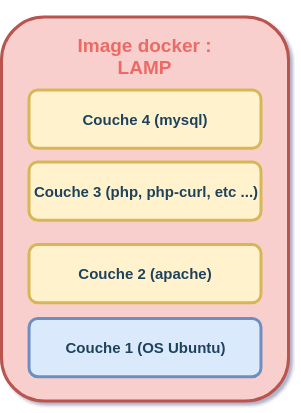
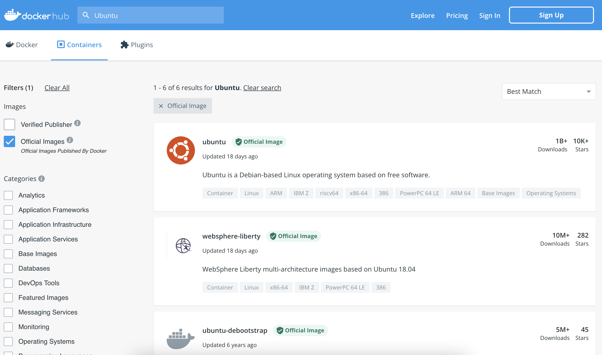
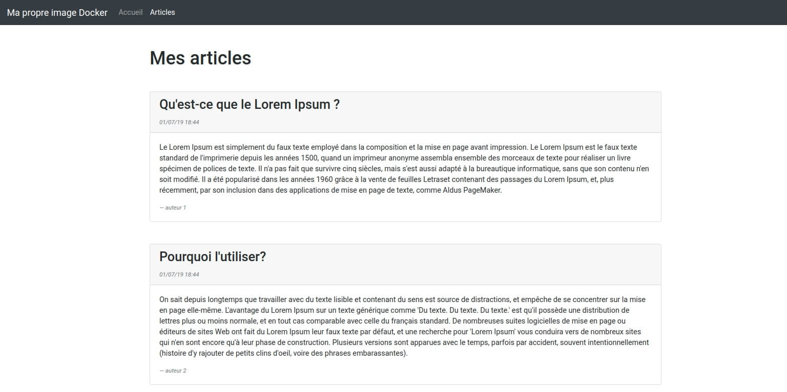
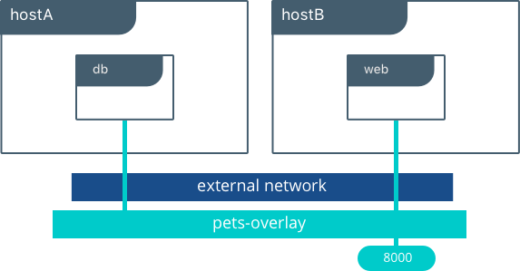

# Docker

- [Docker](#docker)
  - [Histoire](#histoire)
  - [La virtualisation](#la-virtualisation)
    - [fonctionnement de la virtualisation](#fonctionnement-de-la-virtualisation)
    - [avantages de virtualisation](#avantages-de-virtualisation)
    - [inconvénients de la virtualisation](#inconvénients-de-la-virtualisation)
    - [synthèse](#synthèse)
  - [La conteneurisation](#la-conteneurisation)
    - [isolation](#isolation)
    - [avantages de la conteneurisation](#avantages-de-la-conteneurisation)
  - [Pourquoi Docker est si populaire ?](#pourquoi-docker-est-si-populaire-)
  - [C'est quoi exactement un conteneur ?](#cest-quoi-exactement-un-conteneur-)
    - [Les namespaces : limiter les vues](#les-namespaces--limiter-les-vues)
    - [Les Cgroups : limiter les ressources](#les-cgroups--limiter-les-ressources)
    - [Conclusion](#conclusion)
  - [Découverte et installation de Docker](#découverte-et-installation-de-docker)
    - [Vue d'ensemble des éditions et des versions de Docker](#vue-densemble-des-éditions-et-des-versions-de-docker)
    - [installation sous Linux](#installation-sous-linux)
    - [Utilisation de docker sans être root](#utilisation-de-docker-sans-être-root)
  - [Fonctionnement et manipulation des images Docker](#fonctionnement-et-manipulation-des-images-docker)
    - [Qu'est qu'une image Docker ?](#quest-quune-image-docker-)
    - [Quelques commandes utiles pour manipuler les images](#quelques-commandes-utiles-pour-manipuler-les-images)
    - [Télécharger une image depuis le Docker Hub Registry](#télécharger-une-image-depuis-le-docker-hub-registry)
      - [Lister les images disponibles sur le Docker Hub Registry](#lister-les-images-disponibles-sur-le-docker-hub-registry)
      - [Télécharger une images depuis le Docker Hub Registry](#télécharger-une-images-depuis-le-docker-hub-registry)
  - [Fonctionnement et manipulation des conteneurs Docker](#fonctionnement-et-manipulation-des-conteneurs-docker)
    - [Qu'est qu'un conteneur Docker ?](#quest-quun-conteneur-docker-)
    - [Quelques commandes utiles pour manipuler les conteneurs](#quelques-commandes-utiles-pour-manipuler-les-conteneurs)
      - [Créer un conteneur](#créer-un-conteneur)
    - [Afficher la liste des conteneurs](#afficher-la-liste-des-conteneurs)
    - [Supprimer un conteneur](#supprimer-un-conteneur)
    - [Exécuter une commande dans un conteneur](#exécuter-une-commande-dans-un-conteneur)
    - [Afficher les logs d'un conteneur](#afficher-les-logs-dun-conteneur)
    - [Transformer votre conteneur en image](#transformer-votre-conteneur-en-image)
  - [Créer ses propres images Docker avec le Dockerfile](#créer-ses-propres-images-docker-avec-le-dockerfile)
    - [Les instructions du Dockerfile](#les-instructions-du-dockerfile)
    - [Création de notre image](#création-de-notre-image)
      - [Récupération des sources](#récupération-des-sources)
      - [Etude du Dockerfile](#etude-du-dockerfile)
      - [Explication du Dockerfile](#explication-du-dockerfile)
      - [Construction et exécution de notre image](#construction-et-exécution-de-notre-image)
      - [FAQ](#faq)
      - [Publier son image sur le Hub Docker](#publier-son-image-sur-le-hub-docker)
  - [Fonctionnement et manipulation des volumes dans Docker](#fonctionnement-et-manipulation-des-volumes-dans-docker)
    - [Pourquoi les données d'un conteneur sont éphémères ?](#pourquoi-les-données-dun-conteneur-sont-éphémères-)
    - [Créer et gérer des volumes](#créer-et-gérer-des-volumes)
    - [Démarrer un conteneur avec un volume](#démarrer-un-conteneur-avec-un-volume)
    - [Amélioration de notre image LAMP](#amélioration-de-notre-image-lamp)
  - [Gérez vos conteneurs avec Docker Compose](#gérez-vos-conteneurs-avec-docker-compose)
  - [Installation de docker-compose](#installation-de-docker-compose)
  - [Définition des besoins du Docker Compose et amélioration du Dockerfile](#définition-des-besoins-du-docker-compose-et-amélioration-du-dockerfile)
    - [Amélioration du Dockerfile](#amélioration-du-dockerfile)
    - [Les besoins pour notre Docker Compose](#les-besoins-pour-notre-docker-compose)
      - [Pour le conteneur de la base de données](#pour-le-conteneur-de-la-base-de-données)
      - [Pour le conteneur de l'application web](#pour-le-conteneur-de-lapplication-web)
      - [Lancer les conteneurs sans docker-compose](#lancer-les-conteneurs-sans-docker-compose)
    - [Création du docker-compose](#création-du-docker-compose)
      - [Explications](#explications)
      - [Lancer l'application depuis docker-compose.yml](#lancer-lapplication-depuis-docker-composeyml)
      - [Détails de la communication inter-conteneurs](#détails-de-la-communication-inter-conteneurs)
  - [Fonctionnement et manipulation du réseau dans Docker](#fonctionnement-et-manipulation-du-réseau-dans-docker)
    - [Présentation des différents types de réseau Docker](#présentation-des-différents-types-de-réseau-docker)
      - [Le driver Bridge](#le-driver-bridge)
      - [Le driver none](#le-driver-none)
      - [Le driver host](#le-driver-host)
      - [Le driver overlay](#le-driver-overlay)
      - [Le driver macvlan](#le-driver-macvlan)
    - [Manipulation du réseau dans Docker](#manipulation-du-réseau-dans-docker)
      - [Créer et récolter des informations d'un réseau Docker](#créer-et-récolter-des-informations-dun-réseau-docker)
      - [Supprimer, connecter et déconnecter un réseau Docker](#supprimer-connecter-et-déconnecter-un-réseau-docker)
  - [Apprendre à déboguer vos conteneurs et vos images Docker](#apprendre-à-déboguer-vos-conteneurs-et-vos-images-docker)
    - [Les commandes de débogage](#les-commandes-de-débogage)
      - [la commande stats](#la-commande-stats)
      - [la commande logs](#la-commande-logs)
  - [Conclusion et projections](#conclusion-et-projections)

## Histoire

Docker est une plateforme lancée en mars 2013 permettant aux développeurs et aux administrateurs système de développer, déployer et exécuter des applications avec des conteneurs, plus précisément la plateforme permet d'embarquer une application avec toutes ses dépendances dans un process isolé (nommé conteneur) qui peut être ensuite exécutée sur n'importe quelle machine avec n'importe quel système d'exploitation compatible avec le moteur Docker. (plus d'explications seront fournies dans un chapitre dédié aux conteneurs).

Avant de commencer, il faut savoir que le terme Docker signifie à la fois une technologie et à la fois une entreprise, ce qui pourrait parfois porter à confusion.

Docker a été fondée en France (cocorico 🐓🇫🇷), par un diplômé de l'école d'Epitech nommé Solomon Hykes. Par manque d'investissement en France, l'entreprise a souhaité évoluer dans la Silicon Valley, où elle a pu enchaîner des levées de fonds spectaculaires, illustrant ainsi le potentiel attendu de cette technologie.

Son rythme d’adoption serait l’un des plus rapide de toutes les technologies récentes, elle est déjà largement répandue chez les acteurs leaders des nouvelles technologies.

## La virtualisation

Pour comprendre pourquoi la technologie Docker est devenue de nos jours si populaire que ça, il est important d'abord de comprendre quel est l'intérêt des conteneurs en le comparant à la virtualisation.

### fonctionnement de la virtualisation

Le fonctionnement de la virtualisation reste assez simple, c’est qu’au lieu d’avoir un serveur avec un système d’exploitation faisant tourner une ou plusieurs application(s), on préférera mutualiser plusieurs serveurs virtuels depuis un serveur physique grâce à un logiciel nommé l’**hyperviseur**. L’hyperviseur permet d’**émuler** intégralement les différentes **ressources matérielles** d'un serveur physique (tels que l'unité centrale, le CPU, la RAM, le disque dur, carte réseau etc ...), et permet à des machines virtuelles de les partager.

Ainsi ces machines virtuelles nommées aussi VM (Virtual Machine) bénéficieront de ressources matérielles selon leurs besoins (par exemple plus de puissance processeur et plus de mémoire vive mais avec moins d’espace disque). L'avantage c'est qu'il est possible de modifier les ressources physiques de ces VMs en quelques clics. De plus elles **possèdent leur propre système d’exploitation** ainsi que leurs propres applications.


### avantages de virtualisation

- Consacrer les **ressources adaptées** selon les applications qu'on souhaite mettre en place.

- Les machines virtuelles reste simples à manier. Il est possible par exemple de basculer une VM d'un lieu à l'autre voir même de sauvegarder et de dupliquer une VM à volonté sans aucun impact visible pour les utilisateurs.

- La virtualisation **réduit les dépenses** en abaissant le besoin de systèmes matériels physiques. Elle permet de **réduire la quantité de matériel** nécessaire ainsi que les coûts en maintenance, alimentation électrique et refroidissement des composants.

- Les machines virtuelles apportent également une aisance à l'administration car un matériel virtuel n'est pas sujet aux défaillances. Les administrateurs profitent des environnements virtuels pour faciliter les sauvegardes, la **reprise après catastrophe**.

### inconvénients de la virtualisation

- Le fait d’accéder aux ressources de façon virtuelle affaiblie les performances, cela est dû au fait qu'on passe par une **couche d’abstraction matérielle** qui malheureusement doit faire des interprétations entre le matériel en place et celui simulé dans la machine virtuelle.

- Comme éxpliqué plus haut la virtualisation consiste à faire fonctionner sur un seul ordinateur physique plusieurs VMs avec différents systèmes d'exploitation, comme s'ils fonctionnaient sur des ordinateurs distincts. Mais malheureusement cette **couche d'OS** consomme à lui tout seul énormément de ressources alors qu’au final, ce qui nous intéresse c’est la ou les applications qui vont tourner dessus.

### synthèse

On se trouve alors avec une technologie très utile, malléable et économique pour les professionnels, mais malheureusement elle possède aussi son lot d’inconvénients, heureusement que d’autres personnes ont pensé à aller encore plus loin, et d’être encore plus efficace, et pour cela, la conteneurisation a été crée et par la suite la technologie Docker a permis de la populariser.

## La conteneurisation

### isolation

Dans le cas de la virtualisation l’isolation des VMs se fait au niveau matérielles (CPU/RAM/Disque) avec un accès virtuel aux ressources de l'hôte via un hyperviseur. De plus, souvent les serveurs virtuels fournissent un environnement avec plus de ressources que la plupart des applications n'en ont besoin.

Par contre dans le cas de la conteneurisation, l’isolation se fait au niveau du système d’exploitation. Un conteneur va s'exécuter sous Linux de manière native et va **partager le noyau** de la machine hôte avec d'autres conteneurs. ne prenant pas plus de mémoire que tout autre exécutable, ce qui le rend **léger**.

L’image ci-dessous illustre cette phase d’abstraction de l’OS.

|                Virtualisation                |                 Conteneurisation                 |
| :------------------------------------------: | :----------------------------------------------: |
|  |  |

### avantages de la conteneurisation

- Comme vu plus haut les machines virtuelles intègrent elles-mêmes un OS qui consomme plusieurs Giga-octets. Ce n'est pas le cas du conteneur. Le conteneur appel directement l'OS pour réaliser ses **appels système** et exécuter ses applications. Il est beaucoup moins gourmand en ressources.

- Le **déploiement** est un des points clés à prendre en compte de nos jours. On peut déplacer les conteneurs d’un environnement à l’autre très rapidement (en réalité c'est encore plus simple et rapide avec Docker, car il suffit juste de partager des fichiers de config qui sont en général très légers). On peut bien sur faire la même chose pour une machine virtuelle en la déplaçant entièrement de serveurs en serveurs mais n'oubliez pas qu'il éxiste cette couche d'OS qui rendra le déploiement beaucoup plus lent, sans oublier le processus d'émulation de vos ressources physiques, qui lui-même demandera un certain temps d'exécution et donc de la latence en plus.

> La virtualisation reste tout de même une technologie profitable qui a encore de beaux jours devant elle. Pour rappel nous avons besoin d'une machine avec un OS pour faire tourner nos conteneurs. La conteneurisation permet simplement d'optimiser l'utilisation de vos ressources tout en profitant des avantages qu'offre la virtualisation.

La conteneurisation est de plus en plus populaire car les conteneurs sont :

- **Flexible**: même les applications les plus complexes peuvent être conteneurisées.
- **Léger**: les conteneurs exploitent et partagent le noyau hôte.
- **Interchangeable**: vous pouvez déployer des mises à jour à la volée
- **Portable**: vous pouvez créer localement, déployer sur le cloud et exécuter n'importe où votre application.
- **Évolutif**: vous pouvez augmenter et distribuer automatiquement les réplicas (les clones) de conteneur.
- **Empilable**: Vous pouvez empiler des services verticalement et à la volée.

## Pourquoi Docker est si populaire ?

La conteneurisation est loin d'être une technologie récente. En réalité les conteneurs ne sont pas si nouveaux que ça, comme on pourrait le croire. Je peux en citer quelques technologies comme Chroot sur Unix (1982), Jail sur BSD (2000), conteneurs sur Solaris (2004), LXC (Linux conteneurs) sur Linux (2008). La célébrité de docker vient du fait qu'il a su permettre aux utilisateurs de gérer facilement leurs conteneurs avec une interface en ligne de commande simple.

Les conteneurs ne sont pas nouveaux, mais leur utilisation pour déployer facilement des applications l'est.

On pourrait très bien créer un conteneur en utilisant des fonctionnalités nativement disponible sur Linux. Par exemple, en suivant cet [article](https://itnext.io/chroot-cgroups-and-namespaces-an-overview-37124d995e3d)

## C'est quoi exactement un conteneur ?

Avant toute chose, il faut savoir que le noyau Linux offre quelques fonctionnalités comme les **namespaces** (ce qu'un processus peut voir) et les **cgroups** (ce qu'un processus peut utiliser en terme de ressources), qui vont vous permettre d’**isoler les processus Linux** les uns des autres. Lorsque vous utilisez ces fonctionnalités, on appelle cela des **conteneurs**.

Prenons un exemple simple, si jamais on souhaite créer un conteneur contenant la distribution Ubuntu. Fondamentalement, ces fonctionnalités d'isolation proposées par le noyau Linux, vont vous permettent de prétendre d'avoir quelque chose qui ressemble à une machine virtuelle avec l'OS Ubuntu, sauf qu'en réalité ce n'est pas du tout une machine virtuelle mais un **processus isolé** s'exécutant dans le **même noyau Linux**.

> Docker tire parti de plusieurs de ces fonctionnalités proposées par le noyau Linux pour fournir ses fonctionnalités.

### Les namespaces : limiter les vues

Supposons que nous voulons créer une sorte de machine virtuelle. Une des caractéristiques que vous exigerez sera la suivante : "mes processus doivent être séparés des autres processus de l'ordinateur"

Pour réussir à atteindre notre but, on utilisera une fonctionnalité que Linux fournit à savoir les namespaces !

Les namespaces (ou "espaces de noms" en français) isolent les ressources partagées. Ils donnent à chaque processus sa propre vue unique du système, limitant ainsi leur accès aux ressources système sans que le processus en cours ne soit au courant des limitations.

Il éxiste différents types de namespaces, que je vais vous expliquer sur la liste ci-dessous :

- Le **namespace PID** : fournit un ensemble indépendant d'identifiants de processus (PID). Il s'agit d'une structure hiérarchique dans laquelle le namespace parent peut afficher tous les PID des namespaces enfants. Lorsqu'un nouveau namespace est créé, le premier processus obtient le PID 1 et constitue une sorte de processus init de ce namespace. Cela signifie également que si on tue ce processus PID 1 alors on mettra immédiatement fin à tous les processus de son namespace PID et à tous ses descendants.

- Le **namespace IPC** : empêche la communication avec les autres processus, plus simplement il interdit l'échange d'informations avec les autres processus.

- Le **namespace NET** : crée une pile réseau entièrement nouvelle, y compris : un ensemble privé d'adresses IP, sa propre table de routage, liste de socket, table de suivi des connexions, pare-feu et autres ressources liées au réseau.

- Le **namespace MOUNT** : monte un système de fichier propre au processus qui est différent du système de fichier de la machine hôte. Vous pouvez ainsi monter et démonter des systèmes de fichiers sans que cela n'affecte le système de fichiers hôte.

- Le **namespace USER** : fournit à la fois l'isolation des privilèges et la séparation des identifications d'utilisateurs entre plusieurs ensembles. Il permet par exemple de donner un accès root dans le conteneur sans qu'il soit root sur la machine hôte.

- Le **namespace UTS** : associe un nom d'hôte et de domaine au processus pour avoir son propre hostname.

Ce n'est pas vraiment le but de ce cours mais pour s'amuser un peu, on utilisera la commande `unshare` pour créer un namespace PID du programme `bash`.

Juste avant de lancer la commande `unshare`, je vais vous montrer les processus qui tournent déjà sur ma machine hôte :

```bash
ps aux
```

Résultat:

```bash
USER       PID %CPU %MEM    VSZ   RSS TTY      STAT START   TIME COMMAND
root         1  0.0  0.0   8324   156 ?        Ss   09:18   0:00 /init
root         3  0.0  0.0   8328   156 tty1     Ss   09:18   0:00 /init
hatim        4  0.0  0.0  16796  3424 tty1     S    09:18   0:00 -bash
root        16  0.0  0.0   8332   160 tty2     Ss   10:08   0:00 /init
hatim       17  0.0  0.0  16788  3420 tty2     S    10:08   0:00 -bash
root        75  1.8  0.1 225388 16196 ?        Ss   11:24   0:00 /usr/sbin/apache2 -k start
www-data    80  0.0  0.0 225680  2796 ?        S    11:24   0:00 /usr/sbin/apache2 -k start
www-data    81  0.0  0.0 225680  2796 ?        S    11:24   0:00 /usr/sbin/apache2 -k start
www-data    82  0.0  0.0 225680  2796 ?        S    11:24   0:00 /usr/sbin/apache2 -k start
www-data    83  0.0  0.0 225680  2796 ?        S    11:24   0:00 /usr/sbin/apache2 -k start
www-data    84  0.0  0.0 225680  2796 ?        S    11:24   0:00 /usr/sbin/apache2 -k start
mysql      130  2.0  0.0  10660   800 ?        S    11:24   0:00 /bin/sh /usr/bin/mysqld_safe
mysql      493  8.4  1.0 1934168 129464 ?      Sl   11:24   0:00 /usr/sbin/mysqld --basedir=/usr --datadir=/var/lib/mysq
hatim      551  0.0  0.0  17380  1924 tty2     R    11:24   0:00 ps aux
```

Maintenant exécutant notre namespace PID avec la commande unshare :

```bash
sudo unshare --fork --pid --mount-proc bash
```

Je vais maintenant afficher les processus en cours au sein de ce mini conteneur :

```bash
ps aux
```

Résultat:

```bash
USER       PID %CPU %MEM    VSZ   RSS TTY      STAT START   TIME COMMAND
root         1  0.5  0.0  16692  3292 tty2     S    11:27   0:00 bash
root         9  0.0  0.0  17380  1920 tty2     R    11:27   0:00 ps aux
```

Il n'y a que 2 processus en cours d'exécution bash et ps. Preuve que les namespaces permettent de limiter la vue d'un processus.

Nous venons de créer un mini conteneur !

### Les Cgroups : limiter les ressources

Bon jusqu'ici, nous avons vu comment fonctionnent les namespaces, mais que faire si je veux limiter la quantité de mémoire ou de processeur utilisée par l'un de mes processus ? Heureusement que des personnes en 2007 ont développé spécialement pour nous les **groupes de contrôle**.

> Il existe aussi l'outil nommé `nice` (et son petit frère `renice`) permettant de contrôler la priorité des processus sur Linux, sauf que les groupes de contrôle proposent plus de fonctionnalités.

Voici quelques types de cgroup :

- **cgroup cpuset** : assigne des processeurs individuels et des nœuds de mémoire à des groupes de contrôle
- **cgroup cpu** : planifie un accès aux ressources du processeur
- **cgroup cpuacct** : génère des rapports sur les ressources du processeur utilisées
- **cgroup devices** : autorise ou refuse l'accès aux périphériques
- **cgroup net_prio** : permet de définir la priorité du trafic réseau
- **cgroup memory** : définit la limite d'utilisation de la mémoire
- **cgroup blkio** : limite de la vitesse E/S (lecture/écriture) sur périphériques de type bloc (ex : disque dur)
- **cgroup pid** : limite le nombre de processus

Voici un exemple de cgroup limitant l'utilisation de la mémoire :

```bash
sudo cgcreate -a <nom_d_utilisateur> -g memory:<nom_du_cgroup>
```

Voyons ce qu'il y a dedans :

```bash
ls -l /sys/fs/cgroup/memory/<nom_du_cgroup>/
```

Résultat :

```bash
-rw-r--r-- 1 <nom_d_utilisateur> root 0 Okt 10 23:16 memory.kmem.limit_in_bytes
-rw-r--r-- 1 <nom_d_utilisateur> root 0 Okt 10 23:14 memory.kmem.max_usage_in_bytes
```

Ensuite, on va limiter notre cgroup à 20 mégaoctets :

```bash
sudo echo 20000000 >  /sys/fs/cgroup/memory/<nom_du_cgroup>/memory.kmem.limit_in_bytes
```

Maintenant utilisons notre cgroup sur notre programme bash :

```bash
sudo cgexec  -g memory:<nom_du_cgroup> bash
```

Voilà le processus bash ne peut plus dépasser 20 Mo de mémoire !

### Conclusion

Pour résumer, la technologie Docker possède de nombreuses fonctionnalités de nos jours, mais beaucoup d’entre elles reposent sur les fonctionnalités de base du noyau Linux vues plus haut.

Pour rentrer plus dans les détails, les conteneurs contiennent généralement un ou plusieurs programme(s) de manière à les maintenir isolées du système hôte sur lequel elles s'exécutent. Ils permettent à un développeur de conditionner une application avec toutes ses dépendances, et de l'expédier dans un package unique.

En outre, ils sont conçus pour faciliter la mise en place d’une expérience cohérente lorsque les développeurs et les administrateurs système déplacent le code des environnements de développement vers la production de manière rapide et reproductible.

## Découverte et installation de Docker

### Vue d'ensemble des éditions et des versions de Docker

Docker est disponible en deux éditions:

- Docker **Community Edition** (CE)
- Docker **Enterprise Edition** (EE)

Docker Community Edition (CE) est idéale pour les développeurs individuels et les petites équipes cherchant à se familiariser avec Docker et à expérimenter des applications basées sur des conteneurs. De plus cette **version est gratuite**. Ça sera la version que nous utiliserons.

Docker Enterprise Edition (EE) est conçue pour les équipes de développement d’entreprise et les équipes système qui créent, expédient et exécutent des applications critiques pour la production à grande échelle (elle n'est pas gratuite).

La version communautaire Docker dispose de trois types de canaux de mise à jour, stable, test et Nightly :

- **Stable** : cette version vous donne les dernières releases pour une disponibilité générale
- **Test** : cette version vous fournit des pré-versions prêtes à être testées avant la disponibilité générale
- **Nightly** : cette version vous présente les dernières versions de build en cours pour la prochaine release, elle fournit donc un accès plus rapide aux nouvelles fonctionnalités et correctifs pour les tests.

Pour ce cours, nous utiliserons la version communautaire de Docker

### installation sous Linux

Suivre la [documentation officielle](https://docs.docker.com/engine/install/)

Pour vérifier que Docker CE est correctement installé :

```bash
sudo docker --version
```

Résulat :

```bash
Docker version 20.10.11, build dea9396
```

Vérifier également que le service docker est lancé (le lancer si besoin) et qu'il est configuré pour se lancer au démarrage du PC :

```bash
sudo systemctl status docker
sudo systemctl start docker
sudo systemctl enable docker
```

### Utilisation de docker sans être root

Une bonne pratique sous Linux consiste à n'utiliser le compte `root` que lorsque cela est nécessaire. Aussi nous allons faire appartenir notre compte utilisateur non-privilégié au groupe **docker** (ce groupe a été automatiquement créé lors de l'installation) :

```bash
sudo usermod -aG docker $USER
```

Il faut ensuite se déconnecter puis se reconnecter (ou redémarrer) pour que l'appartenance à ce nouveau groupe soit effective. Pour vérifier qu'il est possible d'utiliser docker sans être root, la commande suivante ne devrait pas remonter d'erreur :

```bash
docker ps
```

## Fonctionnement et manipulation des images Docker

### Qu'est qu'une image Docker ?

Sur Docker, **un conteneur est lancé en exécutant une image**.

Une image est un package qui inclut tout ce qui est nécessaire à l'exécution d'une application, à savoir :

- Le code
- Une commande pour exécuter le code
- Les variables d'environnement
- Les bibliothèques
- Les fichiers de configuration

Dans le chapitre suivant vous allez en savoir plus sur les conteneurs. Pour le moment tout ce que vous devez retenir, c'est qu'une image docker est créée à partir d'un fichier nommé le **Dockerfile**. Une image est un modèle composé de **plusieurs couches**, ces couches contiennent notre application ainsi que les fichiers binaires et les bibliothèques requises. Lorsqu'une image est instanciée, son nom est un conteneur, un conteneur est donc une image en cours d'exécution.

Pour mieux comprendre le système de couche, imaginons par exemple qu'on souhaite déployer notre application web dans un serveur LAMP (Linux Apache MySQL PHP) au moyen de Docker. Pour créer notre stack (pile en français), nous aurons besoin de :

- **Une couche OS** pour exécuter notre Apache, MySQL et Php
- **Une couche Apache** pour démarrer notre serveur web et pourquoi pas la config qui va avec (.htaccess, apache2.conf, site-available/, etc ... )
- **Une couche php** qui contiendra un interpréteur Php mais aussi les bibliothèques qui vont avec (exemple : php-curl)
- **Une couche Mysql** qui contiendra notre système de gestion de bases de données Mysql

Au total, notre image docker sera composée de quatre couches, en schéma ceci nous donnerai :



> Il est important de bien différencier une image Docker d'un conteneur Docker car ce sont deux choses distinctes !

### Quelques commandes utiles pour manipuler les images

Récupérer la liste des commandes possibles :

```bash
docker help
docker COMMAND --help
```

Lister les images Docker téléchargées :

```bash
docker image ls
```

Supprimer une image téléchargée (par son ID ou son nom) :

```bash
docker rmi fce289e99eb9
docker rmi hello-world
```

### Télécharger une image depuis le Docker Hub Registry

#### Lister les images disponibles sur le Docker Hub Registry

Maintenant rentrons dans du concret et téléchargeons une image comme par exemple l'image officielle d'Ubuntu depuis le Docker Hub Registry.

Pour faire simple un Registry (registre en français) est une application côté serveur qui permet de stocker et de distribuer des images Docker, le Docker Hub Registry est le registre officiel de Docker.

Il existe deux façons pour voir si une image est disponible dans le Docker Hub Registry, la première consiste à visiter le [site web](https://hub.docker.com/) et vous recherchez directement le nom de l'image dans la barre de recherche.



Vous remarquerez sur l'image la case "Official Image" pour n'afficher que les images officielles. Ainsi je m'assure que l'image Ubuntu que je vais télécharger a bien été crée par l'équipe gérant la distribution Ubuntu.

Il faut bien faire attention aux images qu'on télécharge sur le net. Il faut toujours vérifier au préalable le code source de l'image plus précisément le fichier **Dockerfile**, car on est jamais à l'abri d'avoir des images contenant des programmes vulnérables voire même des images malhonnêtes.

Je ne dis pas non plus qu'il ne faut télécharger que des images officielles mais juste faire attention à ce qu'on télécharge sur le net. Car d'un autre côté il ne faut pas oublier qu'il existe dans le Docker Hub Registry une multitude d'images créées par des utilisateurs expérimentés indépendants. Ces images sont parfois bien plus optimisées que les images officielles car certaines images n'utilisent que le strict minimum pour faire fonctionner leur application permettant ainsi de réduire la taille de l'image.

La deuxième manière pour lister les images disponibles dans le Docker hub Registry, c'est de passer par la ligne de commande :

```bash
docker search ubuntu
```

Résultat :

```bash
NAME                                                      DESCRIPTION                                     STARS     OFFICIAL   AUTOMATED
ubuntu                                                    Ubuntu is a Debian-based Linux operating sys…   13359     [OK]
dorowu/ubuntu-desktop-lxde-vnc                            Docker image to provide HTML5 VNC interface …   595                  [OK]
websphere-liberty                                         
...
owncloud/ubuntu                                           ownCloud Ubuntu base image                      3
smartentry/ubuntu                                         ubuntu with smartentry                          1                    [OK]
1and1internet/ubuntu-16-php-7.1                           ubuntu-16-php-7.1                               1                    [OK]
1and1internet/ubuntu-16-rspec                             ubuntu-16-rspec                                 0                    [OK]
```

#### Télécharger une images depuis le Docker Hub Registry

Pour télécharger une image depuis le Docker hub Registry il faut utiliser la commande suivante (précisez le tag si vous souhaitez un tag différent de **latest**) :

```bash
docker pull ubuntu
```

Pour télécharger une image ubuntu avec un autre tag différent de latest par exemple le tag **20.04**

```bash
docker pull ubuntu:20.04
```

## Fonctionnement et manipulation des conteneurs Docker

### Qu'est qu'un conteneur Docker ?

Un conteneur est **une instance d'exécution d'une image**. Plus précisément un conteneur est ce que l'image devient en mémoire lorsqu'elle est exécutée.

### Quelques commandes utiles pour manipuler les conteneurs

#### Créer un conteneur

Pour créer une instance de notre image, ou autrement dit créer un conteneur, nous utiliserons la commande `docker run` :

```bash
docker run [OPTIONS] <IMAGE_NAME ou ID>
```

Nous allons pour le moment créer un conteneur basé sur l'image [hello-world](https://hub.docker.com/_/hello-world/), et pour faire les choses dans les règles de l'art, nous allons d'abord commencer par télécharger notre image depuis le Docker Hub Registry, et ensuite on va exécuter notre image afin de créer notre conteneur.

**Étape 1** : Téléchargement de l'image hello-world

```bash
docker pull hello-world:latest
```

**Étape 2** : Instanciation de l'image hello-world

```bash
docker run hello-world:latest
```

Cette image n'est pas vraiment utile, car elle n'est prévue que pour afficher un petit message d'information et ensuite quitter.

Téléchargeons une image plus utile, comme par exemple l'image [Ubuntu](https://hub.docker.com/_/ubuntu). On utilisera l'interpréteur de commandes `bash` pour installer `git`.

```bash
docker pull ubuntu:20.04
```

```bash
docker run ubuntu:20.04
```

Vous remarquerez que le conteneur se lance mais quitte immédiatement... C'est parce que nous n'utilisons pas les bonnes options de lancement.
Pour consulter toutes les options de la commande `docker run`:

```bash
docker run --help
```

Comme vous, pouvez le constater il existe beaucoup d'options, mais rassurez-vous, car vous n'avez pas besoin de tous les connaître, voici pour le moment les options qui nous intéressent :

- **-t** : Allouer un pseudo TTY (terminal virtuel)
- **-i** : Garder un STDIN ouvert (l'entrée standard plus précisément l'entrée clavier)
- **-d** : Exécuter le conteneur en arrière-plan et afficher l'ID du conteneur

Dans notre cas nous avons besoin d'une Tty (option -t) et du mode interactif (option -i) pour interagir avec notre conteneur basé sur l'image Ubuntu. Tentons alors l'exécution de ces deux options :

```bash
docker run -it ubuntu:20.04
```

Nous sommes maintenant à l'intérieur de notre conteneur ubuntu avec un shell !

Nous pouvons désormais installer `git`:

```bash
apt update && apt install -y git
```

On vérifie que `git` est bien installé :

```bash
git --version
```

Quittons maintenant notre conteneur avec la commande `exit`, puis recréons le avec la commande `docker run -it ubuntu:20.04`

Exécutez la commande `git --version`, vous obtenez alors une erreur...

```bash
bash: git: command not found
```

Pourquoi ? Car **les données et les fichiers dans un conteneur sont éphémères** !

> Il existe cependant, bien sûr, un moyen pour sauvegarder les données présentes à l'intérieur d'un conteneur ainsi que les packages installés. Nous le verrons un peu plus tard.

### Afficher la liste des conteneurs

Pour lister les conteneurs disponibles sur votre machine :

```bash
docker container ls
```

ou

```bash
docker ps
```

Résultat :

```bash
CONTAINER ID   IMAGE          COMMAND   CREATED          STATUS          PORTS     NAMES
e01ecac0e8bc   ubuntu:20.04   "bash"    11 seconds ago   Up 11 seconds             gracious_lichterman
```

Voici l'explication des différentes colonnes :

- **CONTAINER ID** : id du conteneur
- **IMAGE** : L'image sur laquelle c'est basé le conteneur
- **COMMAND** : Dernière commande lancée lors de l'exécution de votre image (ici la commande httpd-foreground permet de lancer le service apache en premier plan)
- **CREATED** : date de création de votre conteneur
- **STATUS** : statut de votre conteneur, voici une liste des différents états d'un conteneur :
  - created : conteneur créé mais non démarré (cet état est possible avec la commande docker create)
  - restarting : conteneur en cours de redémarrage
  - running : conteneur en cours d'exécution
  - paused : conteneur stoppé manuellement (cet état est possible avec la commande docker pause)
  - exited : conteneur qui a été exécuté puis terminé
  - dead : conteneur que le service docker n'a pas réussi à arrêter correctement (généralement en raison d'un périphérique occupé ou d'une ressource utilisée par le conteneur)
- **PORTS** : les ports utilisés par votre conteneur
- **NAMES** : nom de votre conteneur

Par défaut la commande `docker ps` ou `docker container ls` ne vous affichera que les conteneurs en état running, pour pouvoir afficher les conteneurs peu importe leur état, alors il faut utiliser l'option **-a** ou **--all**

### Supprimer un conteneur

Maintenant que nous avons pu récupérer l'id ou le nom du conteneur, on est capable de supprimer notre conteneur avec la commande suivante :

```bash
docker rm <CONTAINER NAME ou ID>
```

### Exécuter une commande dans un conteneur

Il existe une commande docker exec qui permet de lancer n'importe quelle commande dans un conteneur déjà en cours d'exécution. Nous allons l'utilisée pour récupérer notre interpréteur de commande /bin/bash, ce qui aura pour but de se connecter directement à notre conteneur.

```bash
docker exec -it <CONTAINER NAME ou ID> /bin/bash
```

### Afficher les logs d'un conteneur

Vous aurez besoin de déboguer votre conteneur en regardant les sorties standard et d'erreurs.

Il existe pour cela la commande docker logs qui vient avec deux options très utiles :

- **-f** : suivre en permanence les logs du conteneur (correspond à tail -f)
- **-t** : afficher la date et l'heure de réception des logs d'un conteneur

```bash
docker logs -ft <CONTAINER NAME ou ID>
```

### Transformer votre conteneur en image

> :warning: cette méthode n'est pas vraiment recommandée pour stocker vos données. Il faut pour cela utiliser les volumes, que nous verrons dans un autre chapitre.

Voici les étapes que nous allons suivre :

- Exécuter notre conteneur basé sur l'image officielle Ubuntu

```bash
docker run -it --name monUbuntu  ubuntu:20.04
```

- Installer l'outil git

```bash
apt update && apt install -y git
```

- Mettre du texte dans un nouveau fichier

```bash
echo "ceci est un fichier qui contient des donnes de test" > test.txt && cat test.txt
```

- Transformer notre conteneur en image

```bash
docker commit monUbuntu ubuntugit
```

> A ce stade, vous pouvez voir, votre nouvelle image avec la commande `docker images`

- Relancer notre un nouveau conteneur basé sur cette nouvelle image

```bash
docker run -ti --name ubuntugit_container  ubuntugit
git --version
cat test.txt
```

Notre outil git et notre fichier sont bien présents dans notre nouveau conteneur.

## Créer ses propres images Docker avec le Dockerfile

Il est temps de **créer vos propres images Docker** à l'aide du fichier **Dockerfile**. Petit rappel, une image est un modèle composé de plusieurs couches, ces couches contiennent notre application ainsi que les fichiers binaires et les bibliothèques requises.

Pour s'exercer, nous allons créer notre propre stack LAMP (Linux Apache MySQL PHP) au moyen de Docker. Voici les différentes couches de cette image :

- **Une couche OS** pour exécuter notre Apache, MySQL et Php, je vais me baser sur la distribution Debian.
- **Une couche Apache** pour démarrer notre serveur web.
- **Une couche php** qui contiendra un interpréteur Php mais aussi les bibliothèques qui vont avec.
- **Une couche Mysql** qui contiendra notre système de gestion de bases de données.

Voici le schéma de notre image :


### Les instructions du Dockerfile

Avant de créer notre propre image, je vais d'abord vous décrire les instructions `Dockerfile` les plus communément utilisées.

- **FROM** : Définit l'image de base qui sera utilisée par les instructions suivantes.
- **LABEL** : Ajoute des métadonnées à l'image avec un système de clés-valeurs, permet par exemple d'indiquer à l'utilisateur l'auteur du `Dockerfile`.
- **ARG** : Variables temporaires qu'on peut utiliser dans un `Dockerfile`.
- **ENV** : Variables d'environnements utilisables dans votre `Dockerfile` et conteneur.
- **RUN** : Exécute des commandes Linux ou Windows lors de la création de l'image. Chaque instruction RUN va créer une couche en cache qui sera réutilisée dans le cas de modification ultérieure du `Dockerfile`.
- **COPY** : Permet de copier des fichiers depuis notre machine locale vers le conteneur Docker.
- **ADD** : Même chose que COPY mais prend en charge des liens ou des archives (si le format est reconnu, alors il sera décompressé à la volée).
- **ENTRYPOINT** : comme son nom l'indique, c'est le point d'entrée de votre conteneur, en d'autres termes, c'est la commande qui sera toujours exécutée au démarrage du conteneur. Il prend la forme de tableau JSON (ex : CMD ["cmd1","cmd1"]) ou de texte.
- **CMD** : Spécifie les arguments qui seront envoyés au ENTRYPOINT, (on peut aussi l'utiliser pour lancer des commandes par défaut lors du démarrage d'un conteneur). Si il est utilisé pour fournir des arguments par défaut pour l'instruction ENTRYPOINT, alors les instructions CMD et ENTRYPOINT doivent être spécifiées au format de tableau JSON.
- **WORKDIR** : Définit le répertoire de travail qui sera utilisé pour le lancement des commandes CMD et/ou ENTRYPOINT et ça sera aussi le dossier courant lors du démarrage du conteneur.
- **EXPOSE** : Expose un port.
- **VOLUMES** : Crée un point de montage qui permettra de persister les données.
- **USER** : Désigne quel est l'utilisateur qui lancera les prochaines instructions RUN, CMD ou ENTRYPOINT (par défaut c'est l'utilisateur root).

### Création de notre image

Normalement pour faire les choses dans les règles de l'art, il faut séparer l'image de l'application web par rapport à l'image de la base de données. Mais pour ce cours je vais faire une exception et je vais mettre toute notre stack dans une seule image.

#### Récupération des sources

Commencez par cloner ce dépôt avec la commande :

```bash
git clone https://git.numeezy.com/iut/docker.git
```

Puis rendez-vous dans le dossier `sources`

- **db** : contient un fichier articles.sql, qui renferme toute l'architecture de la base de données.
- **app** : comporte les sources php de notre l'application web.

#### Etude du Dockerfile

```bash
# --------------- DÉBUT COUCHE OS -------------------
FROM debian:stable-slim
# --------------- FIN COUCHE OS ---------------------


# MÉTADONNÉES DE L'IMAGE
LABEL version="1.0" maintainer="ELLERT Alexandre <aellert@numeezy.com>"


# VARIABLES TEMPORAIRES
ARG APT_FLAGS="-q -y"
ARG DOCUMENTROOT="/var/www/html"


# --------------- DÉBUT COUCHE APACHE ---------------
RUN apt-get update -y && \
    apt-get install ${APT_FLAGS} apache2
# --------------- FIN COUCHE APACHE -----------------


# --------------- DÉBUT COUCHE MYSQL ----------------
RUN apt-get install ${APT_FLAGS} mariadb-server

COPY db/articles.sql /
# --------------- FIN COUCHE MYSQL ------------------


# --------------- DÉBUT COUCHE PHP ------------------
RUN apt-get install ${APT_FLAGS} \
    php-mysql \
    php && \
    rm -f ${DOCUMENTROOT}/index.html && \
    apt-get autoclean -y

COPY app ${DOCUMENTROOT}
# --------------- FIN COUCHE PHP --------------------


# OUVERTURE DU PORT HTTP
EXPOSE 80


# RÉPERTOIRE DE TRAVAIL
WORKDIR  ${DOCUMENTROOT}


# DÉMARRAGE DES SERVICES LORS DE L'EXÉCUTION DE L'IMAGE
ENTRYPOINT service mariadb start && mysql < /articles.sql && apache2ctl -D FOREGROUND
```

Voici l'architecture que vous êtes censé avoir :

```bash
├── app
│   ├── db-config.php
│   └── index.php
├── db
│   └── articles.sql
└── Dockerfile
```

#### Explication du Dockerfile

```bash
FROM debian:stable-slim
```

Pour créer ma couche OS, je me suis basée sur l'image [debian-slim](https://hub.docker.com/_/debian/). Vous pouvez, choisir une autre image si vous le souhaitez (il existe par exemple une image avec une couche OS nommée [alpine](https://hub.docker.com/_/alpine), qui ne pèse que 5 MB !), sachez juste qu'il faut adapter les autres instructions si jamais vous choisissez une autre image de base.

```bash
LABEL version="1.0" maintainer="ELLERT Alexandre <aellert@numeezy.com>"
```

Ensuite, j'ai rajouté les métadonnées de mon image. Comme ça, si un jour je décide de partager mon image avec d'autres personnes, alors ils pourront facilement récolter des métadonnées sur l'image (ex: l'auteur de l'image) depuis la commande `docker inspect <IMAGE_NAME>`.

```bash
ARG APT_FLAGS="-q -y"
ARG DOCUMENTROOT="/var/www/html"
```

Ici, j'ai créé deux variables temporaires qui ne me serviront qu'au sein de mon `Dockerfile` pour créer mon image, d'où l'utilisation de l'instruction ARG. La première variable me sert comme arguments pour la commande `apt`, et la seconde est le répertoire de travail de mon apache.

```bash
RUN apt-get update -y && \
apt-get install ${APT_FLAGS} apache2
```

Par la suite, j'ai construit ma couche Apache. Pour cela j'ai d'abord commencé par récupérer la liste de paquets et ensuite j'ai installé mon Apache.

```bash
RUN apt-get install ${APT_FLAGS} mariadb-server
COPY db/articles.sql /
```

Ici, je commence d'abord par installer le serveur mariadb et ensuite je rajoute mon fichier `articles.sql` pour mon futur nouveau conteneur.

```bash
RUN apt-get install ${APT_FLAGS} \
    php-mysql \
    php && \
    rm -f ${DOCUMENTROOT}/index.html && \
    apt-get autoclean -y

COPY app ${DOCUMENTROOT}
```

Ici j'installe l'interpréteur php ainsi que le module php-mysql. j'ai ensuite vidé le cache d'apt-get afin de gagner en espace de stockage. J'ai aussi supprimé le fichier `index.html` du DocumentRoot d'Apache (par défaut `/var/www/html`), car je vais le remplacer par mes propres sources.

```bash
EXPOSE 80
```

J'ouvre le port 80

```bash
WORKDIR  /var/www/html
```

J'ai mis le dossier `/var/www/html` en tant que répertoire de travail, comme ça, quand je démarrerai mon conteneur, alors je serai directement sur ce dossier.

```bash
ENTRYPOINT service mariadb start && mysql < /articles.sql && apache2ctl -D FOREGROUND
```

Ici, lors du lancement de mon conteneur, le service mysql démarrera et construira l'architecture de la base de données grâce à mon fichier articles.sql . Maintenant, il faut savoir qu'un conteneur se ferme automatiquement à la fin de son processus principal. Il faut donc un processus qui tourne en premier plan pour que le conteneur soit toujours à l'état running, d'où le lancement du service Apache en premier plan à l'aide de la commande `apache2 -D FOREGROUND`

#### Construction et exécution de notre image

Voici la commande pour qui nous permet de construire une image docker depuis un `Dockerfile` :

```bash
docker build -t <IMAGE_NAME> .
```

Ce qui nous donnera :

```bash
docker build -t my_lamp .
```

Ensuite, exécutez votre image personnalisée :

```bash
docker run -d --name my_lamp_c -p 8080:80 my_lamp
```

Visitez ensuite la page suivante <http://localhost:8080/>, et vous obtiendrez le résultat suivant :



#### FAQ

> Quelle est la différence entre ENV et ARG dans un `Dockerfile` ?

Ils permettent tous les deux de stocker une variable. La seule différence, est que l'instruction ARG est uniquement accessible **lors de la construction** de l'image (lors du `docker build`) alors que l'instruction ENV permet de déclarer une variable d'environement **lors de l'exécution** du conteneur (lors du `docker run`)

> Quelle est la différence entre COPY et ADD dans un `Dockerfile` ?

Ils permettent tous les deux de copier un fichier/dossier local vers un conteneur. La différence, c'est que ADD autorise les sources sous forme d'url et si jamais la source est une archive dans un format de compression reconnu (ex : zip, tar.gz, etc ...), alors elle sera décompressée automatiquement vers votre cible. Notez que dans les best-practices de docker, ils recommandent d’utiliser l'instruction COPY quand les fonctionnalités du ADD ne sont pas requises.

> Quelle est la différence entre RUN, ENTRYPOINT et CMD dans un `Dockerfile` ?

- L'instruction **RUN** est exécutée pendant la construction de votre image, elle est souvent utilisée pour installer des packages logiciels qui formeront les différentes couches de votre image.
- L'instruction **ENTRYPOINT** est exécutée pendant le lancement de votre conteneur et permet de configurer un conteneur qui s'exécutera en tant qu'exécutable. Par exemple pour notre stack LAMP, nous l'avions utilisée, pour démarrer le service Apache avec son contenu par défaut et en écoutant sur le port 80.
- L'instruction **CMD** est aussi exécutée pendant le lancement de votre conteneur, elle définit les commandes et/ou les paramètres de l'instruction **ENTRYPOINT** par défaut, et qui peuvent être surchargées à la fin de la commande docker run.

Comme expliqué précédemment, il est possible de combiner l'instruction **ENTRYPOINT** avec l'instruction **CMD**.

Je pense qu'un exemple sera plus explicite. Imaginons qu'on souhaite proposer à un utilisateur une image qui donne la possibilité de lister les fichiers/dossiers selon le paramètre qu'il a fournit à la fin de la commande docker run (Par défaut le paramètre sera la racine /).

On va commencer par créer notre `Dockerfile`, en utilisant l'instruction **ENTRYPOINT** :

```bash
FROM alpine:latest

ENTRYPOINT ls -l /
```

Ensuite on construit et on exécute notre image :

```bash
docker build -t test .
```

```bash
docker run test
```

Résultat :

```bash
drwxr-xr-x    2 root     root          4096 Jun 19 17:14 bin
...
drwxr-xr-x   11 root     root          4096 Jun 19 17:14 var
```

Par contre si je tente de surcharger mon paramètre, j'obtiendrai toujours le même résultat :

```bash
docker run test /etc
```

Pour pouvoir régler ce problème, nous allons utiliser l'instruction **CMD**. Pour rappel l' instruction **CMD** combinée avec **ENTRYPOINT** doivent être spécifiées au format de tableau JSON. Ce qui nous donnera :

```bash
FROM alpine:latest

ENTRYPOINT ["ls", "-l"]
CMD  ["/"]
```

On va reconstruire maintenant notre image et relancer notre image avec le paramètre personnalisé.

```bash
docker build -t test .
```

```bash
docker run test /etc
```

Résultat :

```bash
-rw-r--r--    1 root     root             7 Jun 19 17:14 alpine-release
...
-rw-r--r--    1 root     root          4169 Jun 12 17:52 udhcpd.conf
```

#### Publier son image sur le Hub Docker

Si vous souhaitez partager votre image avec d'autres utilisateurs, une des possibilités est d'utiliser le [Hub Docker](https://hub.docker.com/).

Pour cela, commencez par vous inscrire sur la plateforme et créez ensuite un repository public.

L'étape suivante est de se connecter au hub Docker à partir de la ligne de commande

```bash
docker login
```

Récupérer ensuite l'id ou le nom de votre image :

```bash
docker images
```

Résultat :

```bash
REPOSITORY          TAG                 IMAGE ID            CREATED             SIZE
my_lamp             latest              898661ad8fb2        35 seconds ago      497MB
alpine              latest              4d90542f0623        12 days ago         5.58MB
debian              stable-slim         7279351ce73b        3 weeks ago         55.3MB
```

Ensuite il faut rajouter un tag à l'id ou le nom de l'image récupérée. Il existe une commande pour ça, je vous passe d'abord son prototype et ensuite la commande que j'ai utilisée.

```bash
docker tag <IMAGENAME OU ID> <HUB-USER>/<REPONAME>[:<TAG>]
```

soit :

```bash
docker tag my_lamp aellert/lamp:first
```

puis

```bash
docker push aellert/lamp:first
```

## Fonctionnement et manipulation des volumes dans Docker

Comme vous le savez déjà, les données dans un conteneur sont éphémères. Il faut donc trouver un moyen à notre solution "comment sauvegarder les données d'un conteneur". Nous avions vu une méthode qui n'est pas très recommandée, qui consistait à transformer notre conteneur en image et de relancer un nouveau conteneur basé sur cette nouvelle image. Je vous ai aussi parlé d'une autre méthode qui repose sur les volumes, et ça tombe bien car nous allons voir cette méthode plus en détail sur ce chapitre.

### Pourquoi les données d'un conteneur sont éphémères ?

Afin de comprendre ce qu'est un volume Docker, nous devons d'abord préciser le fonctionnement normal du système de fichiers dans Docker.

En effet, une image Docker se compose d'un ensemble de layers (calques) en lecture seule. Lorsque vous lancez un conteneur à partir d'une image, Docker ajoute au sommet de cette pile de layers un nouveau layer en lecture-écriture. Docker appelle cette combinaison de couches un "Union File System".

Voyons voir comment le moteur Docker gère les modifications de vos fichiers au sein de votre conteneur :

- Lors d'une modification de fichier, Docker crée une copie depuis les couches en lecture seule vers le layer en lecture-écriture.
- Lors d'une création de fichier, Docker crée le fichier que sur le layer en lecture-écriture, et ne touche pas au layer en lecture seule.
- Lors d'une suppression de fichier, Docker supprime le fichier que sur le layer en lecture-écriture, et si il est déjà éxistant dans le layer en lecture seule alors il le garde.
- Les données dans le layer de base sont en lecture seule, elles sont donc protégées et intactes par toutes modifications, seul le layer en lecture-écriture est impacté lors de modifications de données.

Lorsqu'un conteneur est supprimé, le layer en lecture-écriture est supprimé avec. Cela signifie que toutes les modifications apportées après le lancement du conteneur auront disparus avec.

### Créer et gérer des volumes

Afin de pouvoir sauvegarder (persister) les données et également partager des données entre conteneurs, Docker a développé le concept de volumes. Les volumes sont des répertoires (ou des fichiers) qui ne font pas partie du système de fichiers Union mais qui existent sur le système de fichiers hôte.

En outre, les volumes constituent souvent le meilleur choix pour persistance des données pour le layer en lecture-écriture, car un volume n'augmente pas la taille des conteneurs qui l'utilisent et son contenu existe en dehors du cycle de vie d'un conteneur donné.

Pour créer un volume, nous utiliserons la commande suivante :

```bash
docker volume create <VOLUMENAME>
```

Soit :

```bash
docker volume create volume-test
```

Pour lister les volumes :

```bash
docker volume ls
```

Résulat :

```bash
DRIVER              VOLUME NAME
local               0af7c41b62cf782b4d053e03b4b11575078bb01bbda90edfa73fbc88ac1703ec
...
local               volume-test
```

Pour obtenir des informations sur un volume, il faut utiliser la commande suivante :

```bash
docker volume inspect volume-test
```

Résultat (format JSON) :

```json
[
    {
        "CreatedAt": "2021-12-22T18:57:38Z",
        "Driver": "local",
        "Labels": {},
        "Mountpoint": "/var/lib/docker/volumes/volume-test/_data",
        "Name": "volume-test",
        "Options": {},
        "Scope": "local"
    }
]
```

Dans ce résultat, on peut remarquer que toutes les nouvelles données de notre conteneur seront stockées sur le point de montage `/var/lib/docker/volumes/volume-test/_data`

Pour supprimer un volume :

```bash
docker volume rm volume-test
```

### Démarrer un conteneur avec un volume

Si vous démarrez un conteneur avec un volume qui n'existe pas encore, Docker le créera pour vous.

Pour démarrer un conteneur avec un volume, il faut utiliser l'option **-v** de la commande `docker run`.

Pour ce chapitre, nous allons créer une petite image pour tester cette option, commencez d'abord par créer un `Dockerfile` avec le contenu suivant :

```bash
FROM alpine:latest

RUN mkdir /data

WORKDIR /data
```

Construisons notre image :

```bash
docker build -t vtest .
```

la commande suivante va créer et monter le volume `data-test` dans le dossier `/data` du conteneur.

```bash
docker run -it --name vtest_c -v data-test:/data vtest
```

Ouvrez un autre terminal et dans celui-ci inspectez le nouveau volume :

```bash
docker volume inspect data-test
```

Résultat :

```json
[
    {
        "CreatedAt": "2021-12-22T19:02:16Z",
        "Driver": "local",
        "Labels": {},
        "Mountpoint": "/var/lib/docker/volumes/data-test/_data",
        "Name": "data-test",
        "Options": {},
        "Scope": "local"
    }
]
```

Nous allons essayer de voir en temps réel le contenu de ce volume, pour cela utilisez la commande suivante sur votre nouveau terminal :

```bash
sudo watch -n 1 ls /var/lib/docker/volumes/data-test/_data
```

Pour le moment le dossier est vide, maintenant retournez vers le terminal avec le shell du conteneur et créez dans le dossier `/data` un fichier avec le texte suivant :

```bash
echo "ceci est un test" > test.txt
```

Si vous retournez sur le nouveau terminal, vous verrez votre nouveau fichier.

Quittons notre conteneur avec `exit` et supprimons le :

```bash
docker rm -f vtest_c
```

Recréons un nouveau conteneur pour vérifier que les données ont bien été sauvegardées :

```bash
docker run -ti --name vtest_c -v data-test:/data vtest
```

Dans ce nouveau conteneur, vérifier  le contenu du fichier crée précédemment :

```bash
cat test.txt
```

Résultat :

```bash
ceci est un test
```

Nos données sont maintenant bien sauvegardées !

### Amélioration de notre image LAMP

Dans le chapitre précédent, nous avions créé une image avec stack LAMP, mais la persistance des données n'a pas été gérée. En effet, lors de la recréation de notre conteneur, nous allons rencontrer les deux problèmes suivants :

Les données de notre base de données ne sont pas sauvegardées.
Les modifications des sources de notre application ne seront pas appliquées.
Pour résoudre ce problème, nous allons utiliser les volumes !

Depuis le dossier `sources`, construisez votre image si ce n'est pas déejà fait :

```bash
docker build -t my_lamp .
```

Concernant la base de données, nous allons créer un volume nommé "mysqldata" qui sera par la suite basé sur le dossier `/var/lib/mysql` du conteneur :

```bash
docker volume create --name mysqldata
```

Pour les sources de mon application, je vais faire les choses différemment. Je vais juste changer le dossier source du volume ( les volumes nous donne cette possibilité). Lançons donc notre conteneur :

```bash
docker run -d --name my_lamp_c -v ${PWD}/app:/var/www/html -v mysqldata:/var/lib/mysql -p 8080:80 my_lamp
```

La commande `$PWD` prendra automatiquement le chemin absolu du dossier courant, donc faites bien attention à exécuter votre image depuis le dossier du projet où mettez le chemin complet si vous souhaitez lancer votre commande depuis n'importe quelle autre chemin.

Vous pouvez dès à présent modifier vos sources, depuis votre conteneur ou votre machine local et vos changements seront permanents et immédiatement traités par l'interpréteur php. Les données de votre base de données seront aussi automatiquement sauvegardées dans le volume `mysqldata`.

## Gérez vos conteneurs avec Docker Compose

Docker Compose est un outil permettant de définir le comportement de vos conteneurs et d’exécuter des applications Docker à conteneurs multiples. La configuration se fait à partir d'un fichier YAML, et ensuite, avec une seule commande, vous créez et démarrez tous vos conteneurs.

## Installation de docker-compose

Docker Compose n'est pas installé par défaut et s'appuie sur le moteur Docker pour fonctionner.

Pour l'installer, suivre la [documentation officielle](https://docs.docker.com/compose/install/)

## Définition des besoins du Docker Compose et amélioration du Dockerfile

Nous allons améliorer notre application LAMP. Par la suite nous allons séparer le conteneur de notre application web par rapport au conteneur de notre base de données.

Au préalable, commencez par télécharger les sources du projet en cliquant [ici](https://www.numeezy.com/files/sources-2.zip) et décompressez ensuite le projet.

### Amélioration du Dockerfile

Profitons en pour améliorer le `Dockerfile` de notre stack LAMP en réduisant son nombre d'instructions. Pour cela, on se basera sur deux nouvelles images :

- L'image officielle `php` avec le tag `7-apache`
- L'image officielle `mysql` avec le tag `5.7`

Pour le moment, nous utiliserons le `Dockerfile` ci-dessous pour construire une image avec une couche OS, Apache et Php sans implémenter aucun service de base de données. Cette image se basera sur l'image officielle `php:7-apache` qui vient déjà avec un OS (distribution Debian). Concernant l'image mysql nous l'utiliserons plus tard dans notre docker-compose.yml.

```bash
FROM php:7-apache

LABEL version="1.0" maintainer="ELLERT Alexandre <aellert@numeezy.com>"

# Activation des modules php
RUN docker-php-ext-install pdo pdo_mysql

WORKDIR  /var/www/html
```

Construisez ensuite votre image avec la commande suivante :

```bash
docker build -t myapp .
```

### Les besoins pour notre Docker Compose

#### Pour le conteneur de la base de données

On va débuter par la récolte des besoins du conteneur de la base de données. Pour celle-ci, il nous faudra :

- Un fichier sql pour créer l'architecture de notre base de données.
- Un volume pour stocker les données.

Avant de foncer tête baissée dans la création/modification de notre fichier sql, il toujours important de vérifier avant ce que nous propose la page Docker Hub de l'[image mysql](https://hub.docker.com/_/mysql). En lisant sa description, les informations qui m'ont le plus captivé sont ses variables d'environnements qu'on peut surcharger, notamment :

- **MYSQL_ROOT_PASSWORD**: spécifie le mot de passe qui sera défini pour le compte MySQL root (c'est une variable obligatoire).
- **MYSQL_DATABASE**: spécifie le nom de la base de données à créer au démarrage de l'image.
- **MYSQL_USER** et **MYSQL_PASSWORD** : utilisées conjointement pour créer un nouvel utilisateur avec son mot de passe. Cet utilisateur se verra accorder des autorisations de super-utilisateur pour la base de données **MYSQL_DATABASE**.

Ces variables d'environnements vont nous aider à créer une partie de l'architecture de notre base de données.

Dans la description de l'image mysql, il existe une autre information très utile. Lorsqu'un conteneur mysql est démarré, il exécutera des fichiers avec des extensions `.sh`, `.sql` et `.sql.gz` qui se trouvent dans le répertoire `/docker-entrypoint-initdb.d`. Nous allons profiter de cette information pour déposer le fichier `articles.sql` (disponible dans les sources téléchargées) dans le dossier `/docker-entrypoint-initdb.d` afin de créer automatiquement notre table SQL.

#### Pour le conteneur de l'application web

Concernant le conteneur de l'application web, nous aurons besoin de :

- Une communication avec le conteneur de la base de données.
- Un volume pour stocker les sources de l'application web.
- Un port réseau pour exposer notre serveur web sur l'extérieur

Me concernant la seule information utile dans la description de la page Docker Hub de l'[image php](https://hub.docker.com/_/php), est qu'il est possible d'installer et d'activer les modules php dans le conteneur php avec la commande `docker-php-ext-install` (C'est la commande utilisée dans notre `Dockerfile` afin d'activer le module `pdo` et `pdo_mysql`).

#### Lancer les conteneurs sans docker-compose

Premièrement je vais vous dévoiler, deux nouvelles options de la commande docker run :

- **-e** : définit/surcharge des variables d'environnement
- **--link** : ajoute un lien à un autre conteneur afin de les faire communiquer entre eux.

Voici à quoi va ressembler la commande `docker run` pour la création du conteneur de la base de données :

```bash
docker run -d -e MYSQL_ROOT_PASSWORD='test' \
-e MYSQL_DATABASE='test' \
-e MYSQL_USER='test' \
-e MYSQL_PASSWORD='test' \
--volume db-volume:/var/lib/mysql \
--volume $PWD/articles.sql:/docker-entrypoint-initdb.d/articles.sql \
--name mysql_c mysql:5.7
```

Voici à quoi va ressembler la commande `docker run` pour la création du conteneur de l'application web :

```bash
docker run -d --volume $PWD/app:/var/www/html -p 8080:80 --link mysql_c --name myapp_c myapp
```

Dans cet exemple, on peut vite remarquer que les commandes `docker run` sont assez longues et par conséquent elles ne sont pas assez lisibles. De plus, vous aurez à lancer cette commande pour chaque nouveau démarrage de l'application. Mais vous aurez aussi à gérer vos différents conteneurs séparément. C'est pour ces raisons, que nous utiliserons le fichier `docker-compose.yml` afin de **centraliser la gestion de nos multiples conteneurs d'une application Docker depuis un seul fichier**. Dans notre cas il va nous permettre d' **exécuter et définir les services, les volumes et la mise en relation des différents conteneurs** de notre application.

### Création du docker-compose

Commencez d'abord par créer un fichier et nommez le `docker-compose.yml`, ensuite copiez collez le contenu ci-dessous. Par la suite, plus bas dans l'article, je vais vous fournir les explications des différentes lignes de ce fichier :

```bash
version: '3.7'

services:
    db:
        image: mysql:5.7
        container_name: mysql_c
        restart: always
        volumes:
            - db-volume:/var/lib/mysql
            - ./db/articles.sql:/docker-entrypoint-initdb.d/articles.sql
        environment:
            MYSQL_ROOT_PASSWORD: test
            MYSQL_DATABASE: test
            MYSQL_USER: test
            MYSQL_PASSWORD: test

    app:
        image: myapp
        container_name: myapp_c
        restart: always
        volumes:
            - ./app:/var/www/html
        ports:
            - 8080:80
        depends_on:
            - db

volumes:
    db-volume:
```

#### Explications

```bash
version: '3.7'
```

Il existe plusieurs versions rétrocompatibles pour le [format du fichier Compose](https://docs.docker.com/compose/compose-file/).

```bash
services:
```

Dans une application Docker distribuée, différentes parties de l'application sont appelées **services**. Les services ne sont en réalité que des conteneurs. Dans notre cas nous aurons besoin d'un service pour notre base de données et un autre pour notre application web.

```bash
db:
    image: mysql:5.7
    container_name: mysql_c
    restart: always
    volumes:
        - db-volume:/var/lib/mysql
        - ./db/articles.sql:/docker-entrypoint-initdb.d/articles.sql
    environment:
        MYSQL_ROOT_PASSWORD: test
        MYSQL_DATABASE: test
        MYSQL_USER: test
        MYSQL_PASSWORD: test
```

Dans cette partie, on crée un service nommé `db`. Ce service indique au moteur Docker de procéder comme suit :

- Se baser sur l'image `mysql:5.7`
- Nommer le conteneur `mysql_c`
- Le `restart: always` démarrera automatiquement le conteneur en cas de redémarrage du serveur hôte.
- Définir les volumes à créer et à utiliser (un volume pour exécuter automatiquement notre fichier sql et un autre pour sauvegarder les données de la base de données)
- Surcharger les variables d'environnements à utiliser

```bash
app:
    image: myapp
    container_name: myapp_c
    restart: always
    volumes:
        - ./app:/var/www/html
    ports:
        - 8080:80
    depends_on:
        - db
```

Ici, on crée un service nommé `app`. Ce service indique au moteur Docker de procéder comme suit :

- Se baser sur l'image nommée `myapp` qu'on avait construit depuis notre `Dockerfile`
- Nommer le conteneur `myapp_c`
- Le `restart: always` démarrera automatiquement le conteneur en cas de redémarrage du serveur hôte.
- Définir les volumes à créer et à utiliser pour sauvegarder les sources de notre application
- Mapper le port 8080 sur le port 80
- Le `depends_on` indique les dépendances du service `app`. Ces dépendances vont provoquer les comportements suivants :
  - Les services démarrent en ordre de dépendance. Dans notre cas, le service `db` est démarré avant le service `app`
  - Les services s'arrêtent selon l'ordre de dépendance. Dans notre cas, le service `app` est arrêté avant le service `db`

```bash
volumes:
    db-volume:
```

Enfin, je demande au moteur Docker de me créer un volume nommé `db-volume`, c'est le volume pour stocker les données de notre base de données.

#### Lancer l'application depuis docker-compose.yml

Voici à quoi doit ressembler votre arborescence :

```bash
├── app
│   ├── db-config.php
│   ├── index.php
│   └── validation.php
├── articles.sql
├── docker-compose.yml
└── Dockerfile
```

Placez vous au niveau du dossier qui contient le fichier `docker-compose.yml` et lancez la commande suivante pour lancés les services :

```bash
docker-compose up -d
```

> Ici l'option **-d** permet d'exécuter les conteneurs du Docker compose en arrière-plan.

Pour vérifier le démarrage des conteneurs issus du `docker-compose.yml` :

```bash
docker ps
```

Résultat :

```bash
CONTAINER ID        IMAGE               COMMAND                  CREATED             STATUS              PORTS                  NAMES
26bb6e0dd252        myapp               "docker-php-entrypoi…"   34 seconds ago      Up 5 seconds        0.0.0.0:8080->80/tcp   myapp_c
b5ee22310ebc        mysql:5.7           "docker-entrypoint.s…"   35 seconds ago      Up 6 seconds
```

Pour seulement lister les conteneurs du `docker-compose.yml`, il suffit d'exécuter la commande suivante :

```bash
docker-compose ps
```

Résultat :

```bash
Name                Command               State          Ports        
-----------------------------------------------------------------------
myapp_c   docker-php-entrypoint apac ...   Up      0.0.0.0:8080->80/tcp
mysql_c   docker-entrypoint.sh mysqld      Up      3306/tcp, 33060/tcp
```

Si jamais vos conteneurs ne sont pas dans l'état `UP`, alors vérifiez les logs des services de votre Docker Compose en tapant la commande suivante :

```bash
docker-compose logs
```

Si tout c'est bien passé, alors visitez la page suivante <http://localhost:8080/>, et vérfiez que l'application est disponible.

Remplissez le formulaire de l'application, et stopper puis détruire les conteneurs du `docker-compose.yml`, avec la commande suivante :

```bash
docker-compose down
```

#### Détails de la communication inter-conteneurs

Sans trop rentrer dans les détails sur la partie réseau, sachez juste qu'un réseau bridge est créé par défaut, plus précisément c'est l'interface `docker0` (ip addr show docker0), c'est un réseau qui permet une communication entre les différents conteneurs.

Donc les conteneurs possèdent par défaut une adresse ip. Vous pouvez récolter cette information grâce à la commande suivante :

```bash
docker inspect -f '{{.Name}} - {{range .NetworkSettings.Networks}}{{.IPAddress}}{{end}}' $(docker ps -aq)
```

Résultat :

```bash
/myapp_c - 172.18.0.2
/mysql_c - 172.18.0.3
```

Pour faire communiquer notre application web avec la base de données, on peux utiliser dans le conteneur de l'app web soit l'ip, le nom du service (ici `db`) ou le nom du conteneur (ici `mysql_c`) de la base de données.

Si vous ouvrez le fichier `db-config.php` dans le dossier app, alors vous verrez la ligne suivante :

```php
const DB_DSN = 'mysql:host=mysql_c;dbname=test';
```

Ici, c'est le nom du conteneur de la base de données qui est utilisé pour communiquer avec ce dernier.

## Fonctionnement et manipulation du réseau dans Docker

Pour que les conteneurs Docker puissent communiquer entre eux mais aussi avec le monde extérieur via la machine hôte, une couche de mise en réseau est nécessaire. Cette couche réseau rajoute une partie d'isolation des conteneurs, et permet donc de créer des applications Docker qui fonctionnent ensemble de manière sécurisée.

Docker prend en charge différents types de réseaux qui sont adaptés à certains cas d'utilisation, que nous allons voir à travers ce chapitre.

### Présentation des différents types de réseau Docker

Le système réseau de Docker utilise des drivers (pilotes). Plusieurs drivers existent et fournissent des fonctionnalités différentes.

#### Le driver Bridge

Tout d'abord, lorsque vous installez Docker pour la première fois, il crée automatiquement un réseau bridge nommé `bridge` connecté à l'interface réseau `docker0` ( consultable avec la commande `ip addr show docker0`). Chaque nouveau conteneur Docker est automatiquement connecté à ce réseau, sauf si un réseau personnalisé est spécifié.

Par ailleurs, l**e réseau bridge est le type de réseau le plus couramment utilisé**. Il est limité aux conteneurs d'un hôte unique exécutant le moteur Docker. Les conteneurs qui utilisent ce driver, ne peuvent communiquer qu'entre eux, cependant ils ne sont pas accessibles depuis l'extérieur.


Pour que les conteneurs sur le réseau bridge puissent communiquer ou être accessibles du monde extérieur, vous devez configurer le mappage de port

#### Le driver none

C'est le type de réseau idéal, si vous souhaitez interdire toute communication interne et externe avec votre conteneur, car votre conteneur sera dépourvu de toute interface réseau (sauf l'interface loopback).

#### Le driver host

Ce type de réseau permet aux conteneurs d'utiliser la même interface que l'hôte. Il supprime donc l'isolation réseau entre les conteneurs et seront par défaut accessibles de l'extérieur. De ce fait, il prendra la même IP que votre machine hôte.


Exemple pour lancer un conteneur basé sur l'image alpine avec un driver de type host attaché à l'interface `eth0` :

```bash
docker run -it --rm --network host --name net alpine ip add show eth0
```

#### Le driver overlay

Si vous souhaitez une mise en réseau multi-hôte native, vous devez utiliser un driver overlay. Il crée un réseau distribué entre plusieurs hôtes possédant le moteur Docker. Docker gère de manière transparente le routage de chaque paquet vers et depuis le bon hôte et le bon conteneur.



#### Le driver macvlan

L'utilisation du driver macvlan est parfois le meilleur choix lorsque vous utilisez des applications qui s'attendent à être directement connectées au réseau physique, car le driver Macvlan vous permet d'attribuer une adresse MAC à un conteneur, le faisant apparaître comme un périphérique physique sur votre réseau. Le moteur Docker route le trafic vers les conteneurs en fonction de leurs adresses MAC


### Manipulation du réseau dans Docker

#### Créer et récolter des informations d'un réseau Docker

La commande pour créer un réseau Docker est la suivante :

```bash
docker network create --driver <DRIVER TYPE> <NETWORK NAME>
```

Dans cet exemple nous allons créer un réseau de type bridge nommé mon-bridge :

```bash
docker network create --driver bridge mon-bridge
```

On va ensuite lister les réseaux docker avec la commande suivante :

```bash
docker network ls
```

Résultat :

```bash
NETWORK ID          NAME                     DRIVER              SCOPE
58b8305ce041        bridge                   bridge              local
91d7f01dad50        host                     host                local
ccdbdbf708db        mon-bridge               bridge              local
10ee25f56420        monimagedocker_default   bridge              local
6851e9b8e06e        none                     null                local
```

Il est possible de récolter des informations sur le réseau docker, comme par exemple la config réseau, en tapant la commande suivante :

```bash
docker network inspect mon-bridge
```

Résultat :

```json
[
    {
        "Name": "mon-bridge",
        "Id": "ccdbdbf708db7fa901b512c8256bc7f700a7914dfaf6e8182bb5183a95f8dd9b",
        ...
        "IPAM": {
            "Driver": "default",
            "Options": {},
            "Config": [
                {
                    "Subnet": "172.21.0.0/16",
                    "Gateway": "172.21.0.1"
                }
            ]
        },
        ...
        "Labels": {}
    }
]
```

> Vous pouvez surcharger la valeur du Subnet et de la Gateway en utilisant les options **--subnet** et **--gateway** de la commande `docker network create`, comme suit :
>
> `docker network create bridge --subnet=172.16.86.0/24 --gateway=172.16.86.1 mon-bridge`

Pour cet exemple, nous allons connecter deux conteneurs à notre réseau bridge créé précédemment :

```bash
docker run -dit --name alpine1 --network mon-bridge alpine
docker run -dit --name alpine2 --network mon-bridge alpine
```

Si on inspecte une nouvelle fois notre réseau mon-bridge, on verra nos deux nouveaux conteneurs dans les informations retournées :

```bash
docker network inspect mon-bridge
```

Résultat :

```json
[
    {
        "Name": "mon-bridge",
        "Id": "ccdbdbf708db7fa901b512c8256bc7f700a7914dfaf6e8182bb5183a95f8dd9b",
        ...
        "Containers": {
            "1ab5f1815d98cd492c69a63662419e0eba891c0cadb2cbdd0fb939ab25f94b33": {
                "Name": "alpine1",
                "EndpointID": "5f04963f9ec084df659cfc680b9ec32c44237dc89e96184fe4f2310ba6af7570",
                "MacAddress": "02:42:ac:15:00:02",
                "IPv4Address": "172.21.0.2/16",
                "IPv6Address": ""
            },
            "a935d2e1ddf76fe49cdb1950653f4a093928020b49ebfea4130ff9d712ffb1d6": {
                "Name": "alpine2",
                "EndpointID": "3e009b56104a1bf9106bc622043a2ee06010b102279e24b4807c7b7ffec166dd",
                "MacAddress": "02:42:ac:15:00:03",
                "IPv4Address": "172.21.0.3/16",
                "IPv6Address": ""
            }
        },
        ...
    }
]
```

D'après le résultat, on peut s'apercevoir que notre conteneur `alpine1` possède l'adresse IP **172.21.0.2**, et notre conteneur `alpine2` possède l'adresse IP **172.21.0.3**. Tentons de les faire communiquer ensemble à l'aide de la commande ping :

```bash
docker exec alpine1 ping -c 1 172.21.0.3
```

Résultat :

```bash
PING 172.21.0.3 (172.21.0.3): 56 data bytes
64 bytes from 172.21.0.3: seq=0 ttl=64 time=0.101 ms
```

Pour information, vous ne pouvez pas créer un network host, car vous utilisez l'interface de votre machine hôte. D'ailleurs si vous tentez de le créer alors vous recevrez l'erreur suivante :

```bash
docker network create --driver host mon-host
```

Erreur :

```bash
Error response from daemon: only one instance of "host" network is allowed
```

On peut ne peut qu'utiliser le driver host mais pas le créer. Dans cet exemple nous allons démarrer un conteneur Apache sur le port 80 de la machine hôte. Du point de vue de la mise en réseau, il s’agit du même niveau d’isolation que si le processus Apache s’exécutait directement sur la machine hôte et non dans un conteneur. Cependant, le processus reste totalement isolé de la machine hôte.

Cette procédure nécessite que le port 80 soit disponible sur la machine hôte :

```bash
docker run --rm -d --network host --name my_httpd httpd
```

Sans aucun mappage, vous pouvez accédez au serveur Apache en accédant à <http://localhost:80/>, vous verrez alors le message "It works!".

Depuis votre machine hôte, vous pouvez vérifier quel processus est lié au port 80 à l'aide de la commande `netstat` :

```bash
sudo netstat -tulpn | grep :80
```

C'est bien le processus httpd qui utilise le port 80 sans avoir recours au mappage de port :

```bash
tcp        0      0 127.0.0.1:8000          0.0.0.0:*               LISTEN      5084/php            
tcp6       0      0 :::80                   :::*                    LISTEN      11133/httpd         
tcp6       0      0 :::8080                 :::*                    LISTEN      3122/docker-prox
```

Enfin arrêtez le conteneur qui sera supprimé automatiquement car il a été démarré à l'aide de l'option **--rm** :

```bash
docker container stop my_httpd
```

#### Supprimer, connecter et déconnecter un réseau Docker

Avant de supprimer votre réseau docker, il est nécessaire au préalable de supprimer tout conteneur connecté à votre réseau docker, ou sinon il suffit juste de **déconnecter votre conteneur de votre réseau docker sans forcément le supprimer**.

Nous allons choisir la méthode 2, en déconnectant tous les conteneurs utilisant le réseau docker `mon-bridge` :

```bash
docker network disconnect mon-bridge alpine1
docker network disconnect mon-bridge alpine2
```

Maintenant, si vous vérifiez les interfaces réseaux de vos conteneurs basées sur l'image alpine, vous ne verrez que l'interface loopback comme pour le driver none :

```bash
docker exec alpine1 ip a
```

Résultat :

```bash
lo:  mtu 65536 qdisc noqueue state UNKNOWN qlen 1000
    link/loopback 00:00:00:00:00:00 brd 00:00:00:00:00:00
    inet 127.0.0.1/8 scope host lo
        valid_lft forever preferred_lft forever
```

Une fois que vous avez déconnecté tous vos conteneurs du réseau docker `mon-bridge`, vous pouvez alors le supprimer :

```bash
docker network rm mon-bridge
```

Cependant vos conteneurs se retrouvent maintenant sans interface réseau bridge, il faut donc reconnecter vos conteneurs au réseau bridge par défaut pour qu'ils puissent de nouveau communiquer entre eux :

```bash
docker network connect bridge alpine1
docker network connect bridge alpine2
```

Vérifiez ensuite si vos conteneurs ont bien reçu la bonne Ip :

```bash
docker inspect -f '{{.Name}} - {{range .NetworkSettings.Networks}}{{.IPAddress}}{{end}}' $(docker ps -aq)
```

Résultat :

```bash
/alpine2 - 172.17.0.3
/alpine1 - 172.17.0.2
```

## Apprendre à déboguer vos conteneurs et vos images Docker

Dans ce chapitre, nous allons nous attaquer à la partie Debug dans Docker. Le but de ce chapitre c'est que vous soyez capable de récolter finement des informations sur vos conteneurs afin d'**être capable de réparer vos conteneurs** mais aussi d'utiliser ces données dans vos scripts dans l'intention d'**automatiser vos tâches d'administration Docker**.

### Les commandes de débogage

#### la commande stats

Imaginez que vous utilisez un conteneur (un Apache par exemple), mais malheureusement il n'arrive plus à répondre malgré le fait que son statut soit toujours à l'état `UP`. Que feriez-vous si étiez dans ce cas précis ?

Dans un premier temps, il serait d'abord intéressant de vérifier les statistiques d'utilisation des ressources de votre conteneur. Ceci pour se faire à l'aide de la commande `docker stats`.

Dans le but de manipuler cette commande, nous allons premièrement télécharger et ensuite lancer l'[image docker httpd](https://hub.docker.com/_/httpd) :

```bash
docker run -tid --name httpdc -p 80:80 httpd
```

Si vous lancez la commande Docker stats sans argument alors elle vous affichera en temps réel les statistiques de consommation de tous vos conteneurs en cours d'exécution. Exemple :

```bash
docker stats
```

Résultat :

```bash
CONTAINER ID    NAME         CPU %        MEM USAGE / LIMIT      MEM %       NET I/O         BLOCK I/O      PIDS
eaa4f4c869a2    ubuntuc      0.00%        1.777MiB / 11.61GiB    0.01%       2.61kB / 0B     0B / 0B        1
24b9fa633549    httpdc       0.00%        7.082MiB / 11.61GiB    0.06%       4.01kB / 0B     0B / 0B
```

Le résultat est sous forme de table, voici ci-dessous une liste d'explication des différentes colonnes de la table de la commande Docker stats :

- **CONTAINER ID** et **NAME** : l'identifiant et le nom du conteneur.
- **CPU %** et **MEM %** : le pourcentage de CPU et de mémoire de l'hôte utilisé par le conteneur.
- **MEM USAGE / LIMIT** : la mémoire totale utilisée par le conteneur et la quantité totale de mémoire qu'il est autorisé à utiliser.
- **NET I/O** : la quantité de données que le conteneur a envoyées et reçues sur son interface réseau.
- **BLOCK I/O** : quantité de données lues et écrites par le conteneur à partir de périphériques en mode bloc sur l'hôte.
- **PIDS** : le nombre de processus ou de threads créés par le conteneur.

Vous pouvez spécifier le nom ou l'id d'un seul ou plusieurs conteneur(s), pour ne visionner que les statistiques propres à vos conteneurs :

```bash
docker stats httpdc
```

Résultat :

```bash
CONTAINER ID    NAME         CPU %        MEM USAGE / LIMIT      MEM %       NET I/O         BLOCK I/O      PIDS
24b9fa633549    httpdc       0.00%        7.082MiB / 11.61GiB    0.06%       4.16kB / 0B     0B / 0B        82
```

Stressons un peu notre conteneur `httpdc` avec un script shell en envoyant plusieurs requêtes, en vue de visualiser l'augmentation de la consommation du conteneur :

```bash
#!/bin/bash
curl_func () {
    curl -s "http://localhost:80/page{1, 2}.php?[1-1000]" &
}

for i in {1..4}
do
    curl_func
done

wait 
echo "All done"
```

En lançant le script sur ma machine hôte, j'ai pu constater une augmentation au niveau de la consommation CPU et du flux réseau du conteneur :

```bash
CONTAINER ID    NAME       CPU %       MEM USAGE / LIMIT       MEM %      NET I/O             BLOCK I/O      PIDS
24b9fa633549    httpdc     25.24%      17.56MiB / 11.61GiB     0.15%      39.8MB / 73.1MB     0B / 0B        136
```

Grâce à l'option **--format** ou **-f** vous pouvez formater le résultat de la commande Docker stats de manière à limiter l'affichage du résultat en ne représentant que les ressources souhaitées. Dans cet exemple je ne vais afficher que la consommation CPU et le flux réseau du conteneur `httpd` sous forme de table :

```bash
docker stats --format "table {{.Name}}\t{{.CPUPerc}}\t{{.NetIO}}" httpdc
```

Résultat :

```bash
NAME        CPU %         NET I/O
httpdc      19.17%         39.8MB / 73MB
```

Voici la liste des différents mots résérvés pour l'option **--format** de la commande Docker stats :

- **.Container** : Nom ou ID du conteneur (entrée utilisateur).
- **.Name** : Nom du conteneur.
- **.ID** : Identifiant du conteneur.
- **.CPUPerc** : Pourcentage de CPU.
- **.MemUsage** : Utilisation de la mémoire.
- **.NetIO** : Utilisation du flux réseau Entrant/Sortant.
- **.BlockIO** : Utilisation du disque dur en Lecture/Écriture.
- **.MemPerc** : Pourcentage de mémoire (non disponible pour le moment sous Windows).
- **.PIDs** : Nombre de PID (non disponible pour le moment sous Windows).
  
Autre chose, si vous désirez récupérer par exemple que la valeur de la consommation CPU à l'instant T de votre conteneur dans votre script pour la stocker ensuite dans une variable et donc par la même occasion d'éviter le résultat en mode streaming, alors vous pouvez utiliser l'option --no-stream, comme suit :

```bash
docker stats --no-stream  --format "{{.CPUPerc}}" httpdc
```

Résultat :

```bash
24.54%
```

#### la commande logs

Il y a des risques que votre conteneur soit constamment à l'état `RESTART`. Dans ce cas il est important de **vérifier les logs de votre conteneur**.

Pour nos tests, nous allons construire une image ou j'ai rajouté exprès une erreur :

```bash
FROM alpine:latest

RUN apk add --no-cache apache2

EXPOSE 80

ENTRYPOINT /usr/sbin/http -DFOREGROUND
```

On construit notre image :

```bash
docker build -t alpineerror .
```

Démarrons notre conteneur avec les options suivantes :

```bash
docker run -d --restart always --name alpineerrorc -p 80:80 alpineerror
```

Si on vérifie l'état de notre conteneur, on constatera alors qu'il essaiera toujours de redémarrer mais sans aucun succès :

```bash
docker ps
```

Résultat :

```bash
CONTAINER ID        IMAGE               COMMAND                  CREATED              STATUS                           PORTS               NAMES
31e4baf228c8        alpineerror         "/bin/sh -c '/usr/sb…"   About a minute ago   Restarting (127) 3 seconds ago                       alpineerror
```

Vérifions ensuite les logs du conteneur afin de trouver la source du problème :

```bash
docker logs alpineerrorc
```

Résultat :

```bash
/bin/sh: /usr/sbin/http: not found
```

Les logs nous indiquent clairement que le chemin de la commande est introuvable. Pour corriger cette erreur il suffit juste de remplacer `/usr/sbin/http` par `/usr/sbin/httpd` dans votre `Dockerfile`.

## Conclusion et projections

Vous voici arrivé(e) au terme de ce cours et je tiens vraiment à vous remercier d'avoir pris le temps de suivre ce cours et à vous féliciter pour avoir tenu jusqu'au bout 🥇.

À travers ce cours, nous avons vu tous les aspects majeurs de Docker, rendant ainsi son utilisation très simple, intéressante et très puissante.

Par rapport à tous ce que nous avons étudié, si je devais décrire les différents avantages de Docker à une entreprise, je dirai que :

Docker apporte une valeur immédiate dans les entreprises, augmentant ainsi rapidement sa productivité. Il vous permet de diffuser vos applications en production plus rapidement tout en réduisant les coûts d'infrastructure et de maintenance, accélérant ainsi la mise sur le marché de nouvelles solutions, de ce fait il fournit de nouvelles expériences client allant des applications monolithiques traditionnelles aux applications cloud natives.

J'espère néanmoins, que ce cours vous aura été utile et agréable et que ça vous aura permis d'y voir un peu plus clair et que les différentes notions de Docker vues, vous auront donné envie d'aller encore plus loin.

La suite ? Autant vous dire tout de suite, qu'on n'en aura pas encore fini avec Docker, puisque la plate-forme repose sur des technologies open source standard, notamment [Kubernetes](https://kubernetes.io/fr/). On le retrouve vraiment partout, pas étonnant d'ailleurs qu'on aperçoit de nos jours sur la plupart des pages d'installation des projets opensource, une partie d'installation Linux, Windows et Docker.
