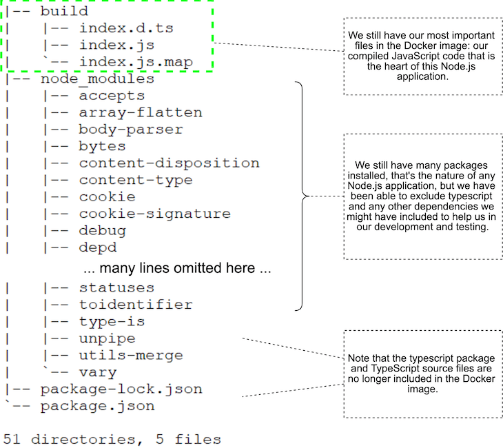

# Docker (avancé)

- [Docker (avancé)](#docker-avancé)
  - [Docker daemon](#docker-daemon)
    - [paramétrage avancé](#paramétrage-avancé)
    - [options utiles](#options-utiles)
  - [Multi-stage builds](#multi-stage-builds)
    - [example avec NodeJS](#example-avec-nodejs)
    - [example avec Golang](#example-avec-golang)
  - [Gestion des signaux d'arrêt](#gestion-des-signaux-darrêt)
  - [Optimisation du cache Docker](#optimisation-du-cache-docker)
  - [Dépendances de démarrage des conteneurs](#dépendances-de-démarrage-des-conteneurs)
  - [Healthcheck](#healthcheck)
  - [Sécurité réseau](#sécurité-réseau)
  - [Initialisation de la base de données](#initialisation-de-la-base-de-données)
  - [ONBUILD](#onbuild)
  - [Exécuter des applications en tant qu'utilisateur non root](#exécuter-des-applications-en-tant-quutilisateur-non-root)
  - [12 factor app](#12-factor-app)
  - [CI/CD Pipelines](#cicd-pipelines)
  - [Kubernetes](#kubernetes)
  - [Bibliographie](#bibliographie)

Pour pouvoir suivre ce cours et réaliser les exercices, vous devrez disposer d'un environnement Linux. Les examples ont été réalisés sur la distribution Ubuntu 20.04. Docker y a été installé en suivant la [documentation officielle](https://docs.docker.com/engine/install/ubuntu/)

## Docker daemon

Sur Linux, le service Docker est géré par `systemd`. Ce dernier est responsable du démarrage et de l'arrêt de Docker. Aussi, il est important de vérifier que le service `docker` démarrera automatiquement lorsque le serveur démarre.

```bash
# systemctl status docker
● docker.service - Docker Application Container Engine
     Loaded: loaded (/lib/systemd/system/docker.service; **enabled**; vendor preset: enabled)
...
```

Si ce n'est pas le cas, il faut indiquer à `systemd` de lancer `docker` automatiquement

```bash
# systemctl enable docker
```

:warning: Lorsque le serveur redémarre, bien que le service `docker` soit positionné en démarrage automatique, tous les conteneurs ne seront pas forcément redémarrés. En effet, chaque conteneur a une politique de redémarrage qui lui est propre.

### paramétrage avancé

Il existe de multiples options permettant de modifier le comportement par défaut du daemon docker. Nous n'allons pas toutes les abordées ici mais plutôt voir des examples réels que l'ont peut rencontrer au quotidien.

La liste complète des options est disponible sur le [site officiel](https://docs.docker.com/engine/reference/commandline/dockerd/)

Pour modifier le comportement du daemon docker, nous allons plutôt choisir de créer/modifier le fichier `/etc/docker/daemon.json`. Après modification de ce fichier un redémarrage de docker sera sytématiquement nécessaire :

```bash
# systemctl restart docker
```

### options utiles

`default-address-pools` : permet de définir la plage IP que Docker va devoir utilisé plutôt que de le laisser choisir arbitrairement. Cela est très utile lorsqu'on déploie Docker sur un réseau d'entreprise segmenté et que Docker n'a aucune connaissance de l'existence de ces segments réseaux.

__exemple__ :

```json
{
  "default-address-pools" : [
    {
      "base" : "10.64.0.0/16",
      "size" : 24
    }
  ]
}
```

`userns-remap` : permet de redéfinir la correspondance entre un utilisateur au sein d'un conteneur Docker avec un tilisateur du système. Cela sert essentiellement lorsqu'un conteneur doit s'exécuter avec les privilèges root et qu'on utilise un volume (la règle de base de sécurité étant d'exécuter son conteneur avec un utilisateur non privilégié). On pourra ainsi faire correspondre l'utilisateur root du conteneur avec un utilisateur non privilégié au niveau du système hôte. Voir la [documentation](https://docs.docker.com/engine/security/userns-remap/)

__exemple__ :

```bash
$ id testuser
uid=1001(testuser) gid=1001(testuser) groups=1001(testuser)
# cat /etc/subuid
testuser:231072:65536
# cat /etc/subgid
testuser:231072:65536
```

```json
{
  "userns-remap": "testuser"
}
```

Cela signifie que `testuser` se voit attribuer une plage d'ID utilisateur subordonnée de 231072 et les 65536 entiers suivants dans l'ordre. L'UID 231072 est mappé dans l'espace de noms (dans le conteneur, dans ce cas) en tant qu'UID 0 (root). L'UID 231073 est mappé en tant qu'UID 1, et ainsi de suite. Si un processus tente d'élever les privilèges en dehors de l'espace de noms, le processus s'exécute avec un UID élevé non privilégié sur l'hôte, qui ne correspond même pas à un utilisateur réel. Cela signifie que le processus n'a aucun privilège sur le système hôte.

## Multi-stage builds

Le concept de "multi-stage builds" est défini dans la [documentation](https://docs.docker.com/develop/develop-images/multistage-build/) de Docker.

Cela sert essentiellement à __minimiser la taille d'une image Docker__ et à __séparer clairement les dépendances de compilation et d'exécution__ ce qui améliore la sécurité.

Je vous encourage à adopter systématiquement cette méthode si vous devez livrer une image Docker en production.

### example avec NodeJS

Deux examples sont étudiés :

- `simpleJS` : une simple application NodeJS réalisée avec [express](https://expressjs.com/fr/). Un conteneur avec un seul stage.
- `multiJS` : une simple application NodeJS réalisée avec [express](https://expressjs.com/fr/) mais compilée avec TypeScript. Un conteneur avec deux stages : un pour la compilation et un pour l'exécuition.

Si on avait écrit le Dockerfile de `multiJS` sans multi-stage, i.e :

```bash
FROM node:16.13.1

WORKDIR /usr/src/app
COPY package*.json ./
COPY tsconfig.json ./
RUN npm install
COPY ./src ./src
RUN npm run build
EXPOSE 80
CMD npm start
```

Voici le résultat qu'on aurait obtenu :


Alors qu'avec le multi-stage, les éléments inutiles sont absents de notre image finale :


### example avec Golang

Dans l'exercice `golang`, vous constaterez que l'on peut diviser par 10 la taille d'une image Docker grâce au multi-stage !

## Gestion des signaux d'arrêt

Un signal est une forme de communication entre processus utilisée par les systèmes de type Unix et et ceux respectant les standards POSIX (c'est le cas de Linux). Il s'agit d'une notification asynchrone envoyée à un processus pour lui signaler l'apparition d'un événement. Quand un signal est envoyé à un processus, le système d'exploitation interrompt l'exécution normale de celui-ci. Si le processus possède une routine de traitement pour le signal reçu, il lance son exécution. Dans le cas contraire, il exécute la routine de traitement des signaux par défaut.

Voici la liste des signaux standards POSIX :

| Nom         | Description                                                                                                                                                                                                                                  | Action par défaut                           |
| ----------- | -------------------------------------------------------------------------------------------------------------------------------------------------------------------------------------------------------------------------------------------- | ------------------------------------------- |
| SIGHUP      | Rupture détectée sur le terminal contrôleur ou mort du processus parent                                                                                                                                                                      | Terminer le processus                       |
| __SIGINT__  | Interruption du clavier (Ctrl+C dans un terminal)                                                                                                                                                                                            | Terminer le processus                       |
| SIGQUIT     | Arrêt du processus                                                                                                                                                                                                                           | Terminer le processus et faire un dump core |
| SIGILL      | Instruction illégale                                                                                                                                                                                                                         | Terminer le processus et faire un dump core |
| SIGABRT     | Arrêt anormal du processus                                                                                                                                                                                                                   | Terminer le processus et faire un dump core |
| SIGFPE      | Erreur sur un nombre flottant                                                                                                                                                                                                                | Terminer le processus et faire un dump core |
| __SIGKILL__ | Tue immédiatement le processus                                                                                                                                                                                                               | Terminer le processus                       |
| SIGSEGV     | Erreur de segmentation                                                                                                                                                                                                                       | Terminer le processus et faire un dump core |
| SIGPIPE     | Erreur de tube (écriture dans un tube sans lecteur)                                                                                                                                                                                          | Terminer le processus                       |
| SIGALRM     | Signal du timer définit par alarm(2)                                                                                                                                                                                                         | Terminer le processus                       |
| __SIGTERM__ | Termine le processus                                                                                                                                                                                                                         | Terminer le processus                       |
| SIGUSR1     | Signaux utilisateurs, l'action est spécifique au processus                                                                                                                                                                                   | Terminer le processus                       |
| SIGUSR2     |
| SIGCHLD     | Processus enfant terminé ou stoppé                                                                                                                                                                                                           | Rien                                        |
| SIGSTOP     | Interromps immédiatement le processus                                                                                                                                                                                                        | Stoppe le processus                         |
| SIGSTP      | Interromps le processus (Ctrl+Z dans un terminal)                                                                                                                                                                                            |
| SIGTTIN     | Entrée de terminal pour un processus en arrière plan                                                                                                                                                                                         | Stoppe le processus                         |
| SIGTTOU     | Sortie de terminal pour un processus en arrière plan                                                                                                                                                                                         | Stoppe le processus                         |
| SIGVTALRM   | chronomètre virtuel (Virtual Timer) expiré                                                                                                                                                                                                   |                                             |
| SIGXCPU     | Le processus a dépassé une certaine limite d'utilisation du processus définit par l'utilisateur. Le processus doit alors sauvegarder les données temporairement obtenues et quitter proprement avant une interception par le signal SIGKILL. |                                             |
| SIGXFSZ     | Le script a fait grossir un fichier au-delà d'une limite définie                                                                                                                                                                             |                                             |
| SIGWINCH    | la taille du terminal contrôlant le processus a changé                                                                                                                                                                                       |                                             |

Voir demo dans `exercices/signalJS`

## Optimisation du cache Docker

Une image docker est composée de couches ("layers"). Des images différentes peuvent se partager des couches (ex : image debian et Ubuntu).
La commande `docker history` permet de visualiser les couches d'une image.
Une instruction `RUN` présente dans un `Dockerfile` ajoutera une couche à l'image résultante d'un `docker build`.

Le processus de construction d'une image docker se résume finalement à empiler les couches les unes au dessus des autres, dans l'ordre défini par les instructions du `Dockerfile`

Lorsqu'on reconstruit une nouvelle version d'une image, chaque couche n'est forcément reconstruite. En effet, si les instructions du `Dockerfile` n'ont pas changées pour les premières couches, alors il n'y a aucune raison de reconstruire celle-ci. Mais lorsqu'une couche est modifiée (par exemple si on modifie une instruction `RUN`) alors les couches sous-jacentes seront systématiquement reconstruites.

Les couches qui n'ont pas de dépendances entre elles peuvent être construites en parallèle.

```bash
FROM node:12 AS build      # 1ere couche
WORKDIR /app
# Les couches 2 et 3 ne seront reconstruites que si on modifie les dépendances de notre projet
COPY package* yarn.lock ./ # 2eme couche
RUN yarn install           # 3eme couche
# Dans la plupart des cas, vous allez ajouter du code à votre application plutôt que de modifier les dépendances
# donc les étapes précédentes profiteront de la mise en cache
COPY public ./public       # 4eme couche
COPY src ./src             # 5eme couche
RUN yarn run build         # 6eme couche

FROM nginx:alpine                                  # 1ere couche
COPY --from=build /app/build /usr/share/nginx/html # 2eme couche
```

__A retenir__ : De manière générale, les éléments qui sont le plus sujets à modifications seront placés plutôt à la fin du `Dockerfile`.

<https://docs.docker.com/get-started/09_image_best/#image-layering>

<https://medium.com/swlh/docker-caching-introduction-to-docker-layers-84f20c48060a>

## Dépendances de démarrage des conteneurs

- [links](https://docs.docker.com/compose/networking/#links)
- [depends_on](https://docs.docker.com/compose/compose-file/compose-file-v3/#depends_on)

```yaml
version: "3.9"
services:
  web:
    build: .
    links:
      - "db:database" # db is reachable from web at the hostnames db and database
    depends_on: # make sure `db` and `redis` are alive before starting
      - db
      - redis
  redis:
    image: redis
  db:
    image: postgres
```

-> [Plus d'informations](https://www.baeldung.com/ops/docker-compose-links-depends-on) sur les différences entre `links`et `depends_on`

## Healthcheck

<https://www.grottedubarbu.fr/docker-healthcheck/>

## Sécurité réseau

Docker Compose fournit des fonctionnalités pour définir des réseaux entre des services individuels, tandis que les conteneurs ne sont autorisés à communiquer qu'avec des services au sein du même réseau. L'exemple ci-dessous montre trois services et deux réseaux (c'est-à-dire `db-backend` et `frontend`). Il interdit la communication entre les services `maildev` et `db`. Seuls `pgweb` et `db` sont autorisés à se parler puisqu'ils font partie du même réseau. Les résultats peuvent être vérifiés en accédant à <http://localhost:8081> après l'exécution de `run.sh`

```yaml
version: '3'

services:

  maildev:
    image: djfarrelly/maildev:1.0.0-rc2
    ports:
      - "8082:80"
      - "25"
    networks:
      - frontend

  pgweb:
    image: sosedoff/pgweb
    restart: on-failure
    ports:
      - "8081:8081"
    environment:
      - DATABASE_URL=postgres://admin:password@db:5432/postgres?sslmode=disable
    networks:
      - frontend
      - db-backend

  db:
    image: postgres:10
    environment:
      POSTGRES_USER: admin
      POSTGRES_PASSWORD: password
    networks:
      - db-backend

networks:
  db-backend:
  frontend:
```

## Initialisation de la base de données

Parfois, il est pratique de commencer avec une base de données initialisée (par exemple, en insérant des exports de base de données vidées). L'image PostgreSQL officielle de Docker prend en charge cette fonctionnalité. Copiez simplement vos scripts SQL ou shell dans `/docker-entrypoint-initdb.d/` (voir l'example ci-dessous). Plus d'informations peuvent être trouvées dans la [documentation officielle](https://hub.docker.com/_/postgres/)

```yaml
version: '3'

services:
  pgweb:
    image: sosedoff/pgweb
    restart: on-failure
    ports:
      - "8081:8081"
    environment:
      - DATABASE_URL=postgres://admin:password@db:5432/persons?sslmode=disable
  db:
    image: postgres:10
    ports:
      - "5432:5432"
    environment:
      POSTGRES_USER: admin
      POSTGRES_PASSWORD: password
      POSTGRES_DB: persons
    volumes:
      - ./init.sql:/docker-entrypoint-initdb.d/init.sql
```

## ONBUILD

<https://docs.docker.com/engine/reference/builder/#onbuild>

## Exécuter des applications en tant qu'utilisateur non root

De nombreuses applications conteneurisées sont exécutées avec l'utilisateur root. Cela n'est pas toujours nécessaire et augmente la surface d'attaque. Dans l'exemple ci-dessous, un serveur Web NGINX est configuré pour pouvoir être exécuté sans droits root.

Plus d'informations :

- L'utilisateur a besoin d'un accès en lecture aux fichiers du site Web.
- L'utilisateur a besoin d'un accès en lecture et en écriture à /var/run/nginx.pid.
- L'utilisateur a besoin d'un accès en lecture et en écriture à /var/cache/nginx.
- N'écoutez pas sur les ports inférieurs à 1024 (pas de 80 ni de 443) car ceux ci ne sont accessible qu'à l'utilisateur root.

```yaml
FROM nginx:1.15.3

# setup configuration
COPY ./nginx.conf /etc/nginx/nginx.conf

# set proper access right
RUN touch /var/run/nginx.pid && \
  chown -R www-data:www-data /var/run/nginx.pid && \
  chown -R www-data:www-data /var/cache/nginx

# change user
USER www-data

# copy static html file
COPY index.html /var/www/htdocs/
```

## 12 factor app

<https://12factor.net/fr/>

## CI/CD Pipelines


<https://docs.gitlab.com/ee/ci/introduction/>

## Kubernetes

Voir [cours Kubernetes](https://git.numeezy.com/iut/k8s)

## Bibliographie

<https://buddy.works/tutorials/optimizing-dockerfile-for-node-js-part-1>

<https://snyk.io/blog/10-best-practices-to-containerize-nodejs-web-applications-with-docker/>

<https://medium.com/trendyol-tech/how-we-reduce-node-docker-image-size-in-3-steps-ff2762b51d5a>
