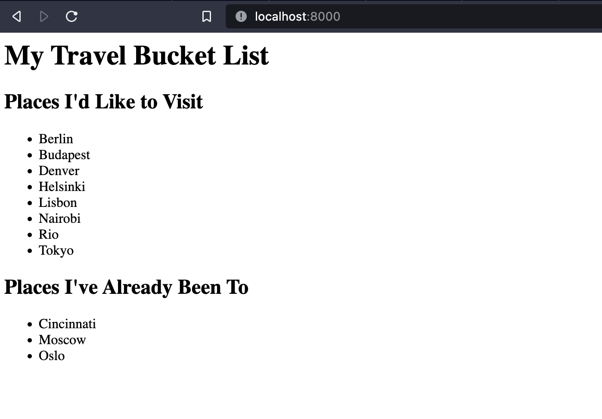

Utiliser Docker Compose pour conteneuriser une application Laravel pour le développement. Lorsque vous aurez terminé, vous aurez une application Laravel de démonstration fonctionnant sur trois conteneurs de service distincts :

* Un service `app` qui s'appuiera sur l'image Docker `php:7.4-fpm` et qui devra intégrer `composer`, les modules PHP `pdo_mysql`, `mbstring`, `exif`, `pcntl`, `bcmath` et `gd`.
* Un service `db` fonctionnant sous MySQL 5.7. Le fichier d'import des données initiale est `docker/mysql/db_init.sql`. Ces données doivent être persistentes.
* Un service `nginx` qui servira les fichiers statiques et qui fera traiter le code PHP au service app. Le fichier de configuration Nginx est `docker/nginx/travellist.conf`

Pour permettre un processus de développement simplifié et faciliter le débogage des apps, nous maintiendrons la synchronisation des fichiers d'application en utilisant des volumes partagés.

Une fois la stack Docker compose démarrée, installer les dépendances PHP :

```bash
docker-compose exec app composer install
```

Et enfin générer une clef d'application (spécifique Laravel)

```bash
docker-compose exec app php artisan key:generate
```

L'application devra être accessible sur <http://localhost:8000>. Le résultat doit afficher :


